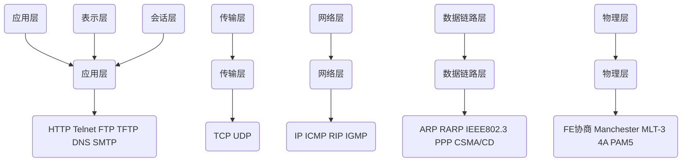
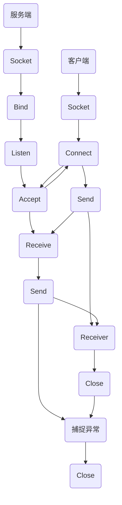

# CS Socket网络编程-1 简介

[TOC]

### Socket相关概念

在计算机领域中，Socket被译为“套接字”。它是计算机之间进行通信的一种约定。通过Socket这种约定可以接收到其他计算机的数据，也可以向其他计算机发送数据。

### Socket的本质

Socket是编程接口（API），对于TCP/IP的封装，TCP/IP也提供了可供程序员做网络开发所用的接口。

### Socket作用

Socket的英文原意是“插座”的意思，通常在计算机编程中称作套接字，可以用来实现不同虚拟机或不同计算机之间的通信。

### Socket的典型应用

- Socket的应用之一就是Web服务器和浏览器：浏览器获取用户输入的URL地址，向服务器发起请求，服务器分析接收到的URL请求，将对应的网页内容返回给浏览器，浏览器再经过解析和渲染，将文字、图片、视频等元素呈现给用户。
- QQ或微信等聊天社交工具等：本地的QQ或微信程序就是客户端，登录过程就是连接服务器的过程，聊天过程就是Socket的发送和接受信息的过程。

### IP地址和端口

### IP地址

IP地址是一个规定，现在使用的是IPv4，既由4个0-255之间的数字组成，在计算机内部储存时只需要4个字节即可。在计算机中，IP地址时分配给网卡的，每个网卡有唯一的IP地址，如果一个计算机有多个网卡，则该计算机则拥有多个不同的IP地址，在同一个网络内部，IP地址不能相同，IP地址的概念类似于电话号码、身份证这样的概念。

由于IP地址不方便记忆，所以又专门创造了**域名**（Domain Name）的概念，其实就是给IP取一个字符的名字，例如163.com等。IP和域名之间存在一定的对应关系。如果把IP地址比作身份证的话，那么域名就是你的姓名。

其实在网络中只能使用IP地址进行数据传输，所以在传输前，需要把域名转换为IP，这个又称作**DNS**的服务器专门完成。

### 端口

可以认为是设备与外界通讯交流的出口。端口可分为虚拟端口和物理端口，其中虚拟端口指计算机内部或交换机路由器的端口，不可见。例如计算机中的80端口、21端口、23端口等。物理端口又称为接口，是可见端口，计算机背板的RJ45网口，交换机路由器集线器等RJ45端口。电话使用RJ11插口也属于物理端口的范畴。

规定一个设备有216个，也就是65536个端口，每个端口对应一个唯一的程序，无论是客户端还是服务器端，都对应一个或多个特定的端口号。由于0-1024之间多被操作系统占用，所以实际编程一般采用1024以后的端口号。

### Socket/TCP五层网络模型



### TCP和UDP

- UDP
    1. 面向无连接，将数据及源封装在数据包中，不需要建立连接
    2. 每个数据包的大小限制在64k内
    3. 因无连接，是不可靠协议
    4. 不需要连接，**速度快**
- TCP
    1. 建立连接，形成传输数据的通道
    2. 在连接中进行大量数据传输，以字节流的形式
    3. 通过三次握手（四次握手）完成连接，是可靠的协议
    4. 必须建立连接，效率会稍低

### Socket/TCP

### TCP报文

TCP报文是发送网络消息需要按照这种报文的格式去包装数据

### Socket编程

### Socket编程方式

Socket起源于Unix，而Unix/Linux基本哲学之一就是“一切皆文件”，都可以打开Open->读写write/read->关闭close模式来操作文件。

Socket就是该模式的一个实现，Socket即使只用特殊的文件，一些Socket函数就是对其进行操作（读写IO、打开、关闭）。因此Socket也提供了类似于连接Connect、关闭Close、发送、接收等方法的调用。

### 数据传输方式

常用stream和dgram

1. Stream
   
    表示面向连接的数据传输方式，数据可以**准确无误**地到达另一台计算机，如果丢失或损坏，可以**重新发送**，但是相对**效率低**。
    
2. Dgram
   
    表示无连接的数据传输方式，计算机**只管数据传输，不做数据校验**，Dgram所做的校验工作较少，所以**效率比Stream高**。
    

例如：QQ视频聊天和语音聊天使用的就是DGRAM传输数据，因为首先需要保证通信的效率，尽量减少延迟，而数据的正确性是次要的，即使丢失很小的一部分数据，视频和音频也可以正常解析，最多出现噪点或杂音，不会对通信质量有实质的影响。

### 服务器端编写步骤

1. 调用socket（）函数创建一个用于通信的套接字
   
    买了个手机
    
2. 给已经创建的套接字绑定一个端口号，一般通过设置网络套接口地址调用bind（）函数来实现
   
    办张手机卡，插上手机卡
    
3. 调用listen（）函数使套接字成为一个监听套接字
   
    等待来电
    
4. 调用accept（）函数来接受客户端的连接，这时就可以和客户端通信
   
    接听到了打来的电话
    
5. 处理客户端的连接请求
   
    接通电话，沟通
    
6. 终止连接
   
    挂断电话
    

### 客户端编写步骤

1. 调用socket（）函数创建一个用于通信的套接字
   
    买了个手机
    
2. 通过设置套接字地址结构，说明客户端与之通信的服务器的IP地址和端口号
   
    输入对方的手机号
    
3. 调用Connect（）函数来建立与服务器的连接
   
    拨号，并等接听
    
4. 调用读写函数发送数据或接收数据
   
    说话、听话
    
5. 终止连接
   
    挂断电话
    

### Socket通信基本流程图



### 客户端

- Socket（）
- Connect（） 建立连接
- Send（） 发送数据
- Receive（）接收数据
- Close（）发送数据

### 服务端

- Socket（）
- Bind（）绑定监听端口
- Listen（）设置监听队列
- Accept（）循环等待客户端连接 建立连接
- Receive（）接收数据
- Send（）发送数据
- 捕捉异常
- Close（）

### 服务端案例

```C#
using System;
using System.Collections.Generic;
using System.ComponentModel;
using System.Data;
using System.Drawing;
using System.Linq;
using System.Text;
using System.Threading.Tasks;
using System.Windows.Forms;
using System.Net.Sockets;//套接字的命名空间
using System.Net;//IPAddress的命名空间
using System.Threading; //线程的命名空间
namespace FrmServer{
    public partial class 服务器 : Form  
    {      
        public 服务器()      
        {     
            InitializeComponent(); 
            toolStripStatusLabel1.Text = "服务器已关闭";   
        }      
        //1.1声明套接字      
        Socket serverSocket = null;     
        //3.2 创建用来专门作为监听来电等待工作的线程  
        Thread listenThread = null;   
        private void btnStartServer_Click(object sender, EventArgs e) 
        {         
            if (btnStartServer.Tag.ToString() == "open")   
            {        
                btnStartServer.Tag = "close";    
                btnStartServer.Text = "关闭服务器";     
                //1.2调用Socket()函数 用于通信的套接字       
                serverSocket = new Socket(AddressFamily.InterNetwork, SocketType.Stream, ProtocolType.Tcp);
                //第一个参数为寻找地址的方式,此时选定为IPV4的地址; 第二个参数为数据传输的方式，此时选择的是Stream传输(能够准确无误的将数据传输到)；第三个参数为执行的协议，此时选择的是TCP协议；       
                //2.套接字绑定端口号，设置套接字的地址调用bind()因为此函数需要EndPoint 所以创建2.1和2.2          
                //2.1 设置地址  IPaddress 在using System.Net;下此时需引入            
                IPAddress address = IPAddress.Parse(txtIP.Text.Trim());          
                //2.2 设置地址和端口           
                IPEndPoint endPoint = new IPEndPoint(address, int.Parse(txtPort.Text.Trim()));//第一个参数为要设置的IP地址，第二参数为端口号         
                try           
                {         
                    //2.套接字绑定端口号和IP          
                    serverSocket.Bind(endPoint);            
                    toolStripStatusLabel1.Text = "服务已开启！";     
                    MessageBox.Show("开启服务成功", "开启服务");      
                }          
                catch (Exception ex)      
                {              
                    MessageBox.Show("开启服务失败：" + ex.Message, "开启服务失败");//ex.Message为出现异常的消息   
                    return;       
                }          
                //3.1监听套接字，等待           
                serverSocket.Listen(10); //参数为最大监听的用户数  
                listenThread = new Thread(ListenConnectSocket);              
                listenThread.IsBackground = true; //关闭后天线程      
                listenThread.Start();    
            }        
            else if (btnStartServer.Tag.ToString() == "close")   
            {             
                toolStripStatusLabel1.Text = "服务器已关闭";      
                btnStartServer.Tag = "open"; 
                btnStartServer.Text = "开启服务器";        
                isOpen = false;   
                serverSocket.Close();   
                serverSocket.Dispose();     
            }       
        }   
        //3.3 用于判断用户是否链到服务器      
        bool isOpen = true;  
        //3.4 监听用户来电 等待   
        void ListenConnectSocket()   
        {         
            while (isOpen)   
            {            
                try      
                {         
                    Socket ClientSocket = serverSocket.Accept(); 
                    byte[] buffer = Encoding.Default.GetBytes("成功连接到服务器！"); 
                    ClientSocket.Send(buffer);             
                    string client = ClientSocket.RemoteEndPoint.ToString();        
                    listBox1.Invoke(new Action<string>((msg) => {listBox1.Items.Add(DateTime.Now + ": " + msg);}), client); 
                    Thread thr = new Thread(ReceiveCkientMsg);           
                    thr.IsBackground = true;        
                    thr.Start(ClientSocket);     
                }             
                catch (Exception ex)    
                {        
                    listenThread.Abort(ex.Message);          
                }     
            }    
        }     
        /// <summary>    
        /// 服务器解释用户消息    
        /// </summary>    
        /// <param name="clientSocket"></param>  
        private void ReceiveCkientMsg(object clientSocket)    
        {        
            Socket client = clientSocket as Socket;     
            while (true)     
            {             
                byte[] recBuffer = new byte[1024 * 1024 * 2];   
                int length = -1; 
                try            
                {            
                    length = client.Receive(recBuffer);      
                }          
                catch (Exception ex)     
                {           
                    string str = client.RemoteEndPoint.ToString();      
                    this.Invoke(new Action(() => {  listBox1.Items.Add($"{str}:{str}"); 
                                                  listBox1.Items.Remove(str);     
                                                 }));         
                    break;         
                }        
                if (length==0)      
                {               
                    string str = client.RemoteEndPoint.ToString();    
                    this.Invoke(new Action(() =>    
                                           {             
                                               listBox1.Items.Add($"{str}:下线了！");   
                                               listBox1.Items.Remove(str);   
                                           }));       
                    break;    
                }           
                else      
                {       
                    string msg = Encoding.Default.GetString(recBuffer,0, length);       
                    string msgStr = $"{DateTime.Now}【接收{client.RemoteEndPoint.ToString()}】{msg}";    
                    this.Invoke(new Action(() =>           
                                           {           
                                               txtReceive.AppendText(msgStr + Environment.NewLine);   
                                           }));        
                }     
            }     
        }   
    }}
```

### 客户端案例

```C#
using System;
using System.Collections.Generic;
using System.ComponentModel;
using System.Data;
using System.Drawing;
using System.Linq;
using System.Text;
using System.Threading.Tasks;
using System.Windows.Forms;
using System.Net.Sockets;
using System.Net;
using System.Threading;
namespace FrmClient{ 
    public partial class Form1 : Form  
    {       
        public Form1()  
        {        
            InitializeComponent();   
        }        
        //1.1创建套接字   
        Socket clientSocket = null;  
        Thread clientThread = null;    //连接服务器      
        private void btnConnectStart_Click(object sender, EventArgs e)     
        {      //1.2     
            clientSocket = new Socket(AddressFamily.InterNetwork, SocketType.Stream, ProtocolType.Tcp);//地址类型，数据传输方式，协议    
            //2.1 设置IP地址   
            IPAddress address = IPAddress.Parse(txtIP.Text.Trim());   
            //2.2 设置IP地址和端口号         
            IPEndPoint endPoint = new IPEndPoint(address, int.Parse(txtPort.Text.Trim()));       
            try        
            {      
                txtRecive.AppendText("与服务器连接中..." + Environment.NewLine);   
                //3与服务器建立连接      
                clientSocket.Connect(endPoint); // 与服务器连接        
            }           
            catch (Exception ex)          
            {            
                MessageBox.Show("连接失败："+ex.Message,"友情提示");          
                return;         
            }        
            txtRecive.AppendText("与服务器连接成功！" + Environment.NewLine);    
            //4.接收或发送消息 使用线程来实现    
            clientThread = new Thread(ReceiveMsg);       
            clientThread.IsBackground = true; //开启后台线程  
            clientThread.Start();    
        }   
        private void ReceiveMsg()    
        {         
            while (true)     
            {      
                byte[] recBuffer = new byte[1024 * 1024 * 2];//声明最大字符内存    
                int length = -1; //字节长度      
                try        
                {           
                    length = clientSocket.Receive(recBuffer);//返回接收到的实际的字节数量  
                }          
                catch (SocketException ex)      
                {          
                    break;            
                }          
                catch (Exception ex)     
                {            
                    this.Invoke(new Action(() =>        
                                           {       
                                               txtRecive.AppendText($"与服务器断开连接：{ex.Message}{Environment.NewLine}");          
                                           }));                
                    break;    
                }         
                //接收到消息        
                if (length>0)             
                {                   
                    string msg = Encoding.Default.GetString(recBuffer, 0, length);//转译字符串(字符串，开始的索引，字符串长度)  
                    string str = $"{DateTime.Now}【接收】{msg}{Environment.NewLine}";//接收的时间，内容，换行     
                    this.Invoke(new Action(() =>         
                                           {          
                                               txtRecive.AppendText(str);//添加到文本     
                                           }));            
                }       
            }   
        }      
        //发送消息    
        private void btnSend_Click(object sender, EventArgs e)   
        {            string str = txtSendBox.Text.Trim();     
         byte[] buffer = Encoding.Default.GetBytes(str);      
         clientSocket.Send(buffer);        
         this.Invoke(new Action(() =>        
                                {          
                                    txtRecive.AppendText($"{DateTime.Now}【发送】{str}{Environment.NewLine}");   
            }));     
        }    
    }}
```

~~~ C#
using System.Net.Sockets;
using System.Net;
using System.Net.NetworkInformation;
using System.Text;
using System.Xml;

namespace InputPCKey
{
    public partial class Form1 : Form
    {
        string ipv4 = getLocalIPAddressWithNetworkInterface(NetworkInterfaceType.Wireless80211);
        public Form1()
        {
            InitializeComponent();
            CheckForIllegalCrossThreadCalls = false;
            lblLog.Text = ipv4;
        }

        private void button1_Click(object sender, EventArgs e)
        {
            new Thread(new ThreadStart(connAndroid)).Start();

        }
        private void button2_Click(object sender, EventArgs e)
        {
            new Thread(new ThreadStart(android)).Start();
        }
        private void connAndroid()
        {
            string[] ips = ipv4.Split('.');
            lblLog.Text = "正在连接手机端";
            IPAddress ip = new IPAddress(new byte[] { Byte.Parse(ips[0]), Byte.Parse(ips[1]), Byte.Parse(ips[2]), Byte.Parse(ips[3]) });
            TcpListener server = new TcpListener(ip, 7701);
            server.Start();
            TcpClient client = server.AcceptTcpClient();
            lblLog.Text = "已连接";
        }
        private void android()
        {
            IPAddress ip = IPAddress.Parse(ipv4);
            TcpClient client = new TcpClient();
            client.Connect(ip, 7701);
        }
        public delegate void showData(string msg);//委托,防止跨线程的访问控件，引起的安全异常
        private const int bufferSize = 8000;//缓存空间
        private TcpClient client;
        private TcpListener server;
        /// <summary>
        /// 结构体：Ip、端口
        /// </summary>
        struct IpAndPort
        {
            public string Ip;
            public string Port;
        }

        private void button3_Click(object sender, EventArgs e)
        {

            Thread thread = new Thread(reciveAndListener);
            //如果线程绑定的方法带有参数的话，那么这个参数的类型必须是object类型，所以讲ip,和端口号 写成一个结构体进行传递
            IpAndPort ipHePort = new IpAndPort();
            ipHePort.Ip = ipv4;//服务器IP
            ipHePort.Port = "7701";//为程序设置端口

            thread.Start((object)ipHePort);
        }
        /// <summary>
        /// 侦听客户端的连接并接收客户端发送的信息
        /// </summary>
        /// <param name="ipAndPort">服务端Ip、侦听端口</param>
        private void reciveAndListener(object ipAndPort)
        {
            IpAndPort ipHePort = (IpAndPort)ipAndPort;

            IPAddress ip = IPAddress.Parse(ipHePort.Ip);
            server = new TcpListener(ip, int.Parse(ipHePort.Port));
            server.Start();//启动监听
            lblLog.Text = "服务端开启侦听....";
            //  btnStart.IsEnabled = false;

            //获取连接的客户端对象
            client = server.AcceptTcpClient();
            lblLog.Text = "有客户端请求连接，连接已建立！";

            //获得流
            NetworkStream reciveStream = client.GetStream();

            #region 循环监听客户端发来的信息

            do
            {
                byte[] buffer = new byte[bufferSize];
                int msgSize;
                try
                {
                    lock (reciveStream)
                    {
                        msgSize = reciveStream.Read(buffer, 0, bufferSize);
                    }
                    if (msgSize == 0)
                        return;
                    string msg = Encoding.Default.GetString(buffer, 0, bufferSize);
                    lblLog.Text = msg;//接收到的信息放到textBox里
                }
                catch (Exception ex)
                {
                    server.Stop();
                    string aa = ex.Message;
                    MessageBox.Show(aa);
                    lblLog.Text = "出现异常：连接被迫关闭";
                    break;
                }
            } while (true);

            #endregion
        }
        public static string getLocalIPAddressWithNetworkInterface(NetworkInterfaceType _type)
        {
            string output = "";
            foreach (NetworkInterface item in NetworkInterface.GetAllNetworkInterfaces())
            {
                if (item.NetworkInterfaceType == _type && item.OperationalStatus == OperationalStatus.Up)
                {
                    foreach (UnicastIPAddressInformation ip in item.GetIPProperties().UnicastAddresses)
                    {
                        if (ip.Address.AddressFamily == AddressFamily.InterNetwork)
                        {
                            output = ip.Address.ToString();
                        }
                    }
                }
            }
            return output;


        }
    }
}
~~~

