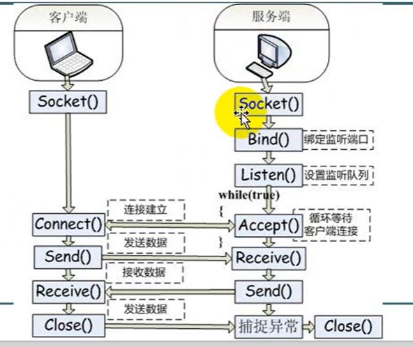

# Socket 网络编程

两种类型

*   流式Scoket（stream）：是一种面向连接的Socket，针对面向连接的TCP服务应用，安全但是效率低
*   数据报式Socket（datagram）：是一种无连接的Socket，对应无连接的UDP服务应用，不安全（丢失，数据混乱，在接收端要分析重排及要求重发），但效率高

### 服务器监听基础

~~~ C#
Socket socket = new Socket(AddressFamily.InterNetwork, SocketType.Stream, ProtocolType.Tcp);
IPEndPoint point = new IPEndPoint(IPAddress.Parse("192.168.212.133"), 7701);
socket.Bind(point);
socket.Listen(10);
log("监听中....");
Socket socketSend =  socket.Accept();
log("连接成功");
~~~

为了让更多的客户端连接，Accept应该写在while循环里面

开启新线程解决程序卡死问题。

~~~ C#
void Listen(object o)
{
    Socket socket = o as Socket;
    while (true)
    {
    Socket socketSend = socket.Accept();
    log("连接成功"+socketSend.RemoteEndPoint.ToString());
    }          
}
~~~

~~~ C#
Thread thread = new Thread(Listen);
thread.Start(socket);
~~~

#### 服务器接收客户端发送来的消息

socketSend.Receive(buffer)；

~~~ C#
byte[] buffer = new byte[1024 * 1024 * 2];
int r = socketSend.Receive(buffer);
string str = Encoding.UTF8.GetString(buffer,0,r);
~~~

为了防止socket.Accept卡死线程，所以，接收消息应该放在新线程的循环中。

~~~ C#
 void Recive(Object o)
{
     while (true)
     {
     Socket socketSend = o as Socket;
     byte[] buffer = new byte[1024 * 1024 * 2];
     int r = socketSend.Receive(buffer);
     if (r==0)
     	break;
     string str = Encoding.UTF8.GetString(buffer, 0, r);
     log(str);
     }
}
~~~

~~~ C#
Thread thread = new Thread(Recive);
thread.Start(socketSend);
~~~

>   使用try-catch可以防止网络异常导致的报错

#### 多客户端通讯

使用Dictionary储存ip和socket。

### 客户端通信基础

~~~ C#
Socket socket = new Socket(AddressFamily.InterNetwork, SocketType.Stream, ProtocolType.Tcp);
IPEndPoint point = new IPEndPoint(IPAddress.Parse("192.168.212.133"),7701);
socket.Connect(point);
~~~

向服务器发送消息

Socket设置为全局变量

~~~ C#
string mess = txtMess.Text;
byte[] buffer = Encoding.UTF8.GetBytes(mess);
socket.Send(buffer);
~~~

### server

~~~ C#
using System.Net;
using System.Net.Sockets;
using System.Text;

namespace ScoketTEST
{
    public partial class Form1 : Form
    {
        Socket socketSend;
        public Form1()
        {
            InitializeComponent();
            Control.CheckForIllegalCrossThreadCalls = false;
        }
        private void button1_Click(object sender, EventArgs e)
        {
            Socket socket = new Socket(AddressFamily.InterNetwork, SocketType.Stream, ProtocolType.Tcp);
            IPEndPoint point = new IPEndPoint(IPAddress.Parse("192.168.212.133"), 7701);
            socket.Bind(point);
            socket.Listen(10);
            log("监听中....");

            Thread thread = new Thread(Listen);
            thread.Start(socket);
        }
        void Listen(object o)
        {
            while (true)
            {
                Socket socket = o as Socket;
                socketSend = socket.Accept();
                log("连接成功"+socketSend.RemoteEndPoint.ToString());
                Thread thread = new Thread(Recive);
                thread.Start(socketSend);
            }          
        }
        void Recive(Object o)
        {
            while (true)
            {
                Socket socketSend = o as Socket;
                byte[] buffer = new byte[1024 * 1024 * 2];
                int r = socketSend.Receive(buffer);
                if (r==0)
                {
                    break;
                }
                string str = Encoding.UTF8.GetString(buffer, 0, r);
                log(str);
            }
        }
        public void log(Object log)
        {
            txtLog.AppendText(log+"\r\n");
        }
        private void button2_Click(object sender, EventArgs e)
        {
            byte[] buffer = Encoding.UTF8.GetBytes(txtSend.Text);
            socketSend.Send(buffer);

        }
    }
}
~~~

### Client

~~~ C#
using System.Net;
using System.Net.Sockets;
using System.Text;

namespace ScoketClentTEST
{
    public partial class Form1 : Form
    {
        Socket socket;
        public Form1()
        {
            InitializeComponent();
        }
        private void Form1_Load(object sender, EventArgs e)
        {
            Control.CheckForIllegalCrossThreadCalls = false;
        }
        private void button1_Click(object sender, EventArgs e)
        {
            socket = new Socket(AddressFamily.InterNetwork, SocketType.Stream, ProtocolType.Tcp);
            IPEndPoint point = new IPEndPoint(IPAddress.Parse("192.168.212.133"),7701);
            socket.Connect(point);
            Thread thread = new Thread(Recive);
            thread.Start();
        }
        void Recive()
        {
            while (true)
            {
                byte[] buffer = new byte[1024 * 1024 * 2];
                int r = socket.Receive(buffer);
                if (r == 0)
                {
                    break;
                }
                string str = Encoding.UTF8.GetString(buffer);
                log(str);
            }
        }
        void log(string log)
        {
            txtLog.AppendText(log + "\r\n");
        }
        private void button2_Click(object sender, EventArgs e)
        {
            string mess = txtMess.Text;
            byte[] buffer = Encoding.UTF8.GetBytes(mess);
            socket.Send(buffer);
        }
    }
}
~~~

