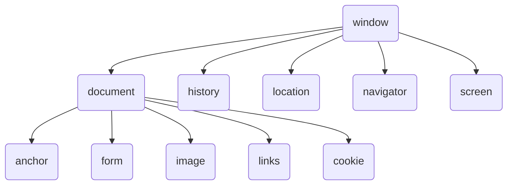

# BOM

## BOM

当用户在浏览器中打开一个网页时，浏览器会自动创建一些对象，这些对象中存放了浏览器窗口的属性和其他相关信息

BOM是一个层次化的集合，每个层次上的对象，都可以通过他们的父对象访问，可以通过window对象访问BOM中的所有对象。

- document：文档对象模型
- history：历史记录
- location：地址栏
- navigator：浏览器
- screen：屏幕%%%%

### history对象

- history.back()后退
- history.forword()前进
- history.go()前进或后退指定页

### location对象

- location.hostname返回web主机的域名
- location.pathname返回当前页面的路径和文件名
- location.port返回web主机的端口（80或443）
- location.protocol返回所使用的web协议（http:// 或 https://）
- location.href属性返回当前页面的URL
- location.assign()方法加载新的文档，类似于打开页面

### 窗口尺寸、工作区尺寸

可视区尺寸

- document.documentElement.clientWidth
- document.documentElement.clientHeight

滚动距离

- document.body.scrollTop
- document.documentElement.scrollTop
