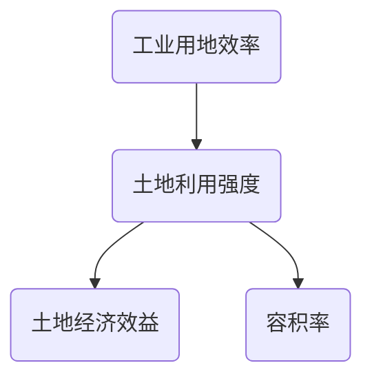

# MarkDown语法 - 1

[TOC]

### 标题标签

# 一级标题

## 二级标题

### 三级标题

### 四级标题

### 五级标题

### 六级标题

### 段落

段落的换行是使用两个以上空格加上回车

### 字体

*斜体字* **粗体字** *斜体字*

**粗体字**

***粗斜体字***

***粗斜体字***

### 分割线

在一行中使用三个以上星号，减号，底线来建立一个分割，行内不能有其他东西。

---

---

### 删除线

~~删除线~~

### 下划线

下划线

### 脚注

脚注[1](about:blank#fn1)

### 列表

无序列表使用星号，加号或是减号，作为列表标记，这些列表标记后面要添加一个空格

- 第一项
- 第二项
- 第三项
- 第一项
- 第二项
- 第三项
- 第一项
- 第二项
- 第三项

有序列表使用数字加点来表示

1. 第一项
2. 第二项
3. 第三项

列表嵌套 只需在子列表中的选项前面添加四个空格即可

1. 第一项:
    - 第一
    - 第二
    - 第三
2. 第二项： - 第一 - 第二 - 第三

### 区块

> 区块
> 

区块中使用列表

> 区块中的列表
> 
> 1. 第一项
> 2. 第二项
> - 第一项
> - 第二项

区块中使用区块

> 区块
> 
> 
> > 区块中的区块
> > 
> > 
> > > 区块中的区块中的区块
> > > 

列表中使用区块

- 第一项
  
    > 区块
    > 
- 第二项
  
    > 区块
    > 

### 代码

如果是段落上的一个函数或片段可以用单引号把他包起来。

`printf()`函数

代码区块，使用四个空格或者一个制表符（Tab键）。或者ctrl+shift+K。

```java
int i = 0;while(true){    i++;}
```

也可以使用三个点 加上代码语言

```java
for(int i = 0 ; i < 100 ; i++){}
```

### 链接

[链接名称](链接地址)

[百度一下，你就知道](https://www.baidu.com/)

或者直接使用链接地址

[http://www.baidu.com](http://www.baidu.com/)

高级链接

可以通过变量来设置一个链接，变量放置在文档末尾进行：

百度链接[百度][1]

1 https://www.baidu.com/

### 图片

！[alt 属性文本](图片地址%20图片标题可选)


RUNOOB 图标

Markdown还没有办法指定图片的高度与宽度，如果需要，可以使用

标签


使用|来分隔不同的单元格，使用-来分隔表头和其他行。

[Untitled](MarkDown%E8%AF%AD%E6%B3%95%20-%201%20e41890af46134026a92afa0c87ca2572/Untitled%20Database%208870e57b6519483cbc151f9fbc3ba8b9.csv)

### 高级技巧

支持的HTML标签

Ctrl

转义

使用反斜杠显示特殊字符

**粗体**

- *正常显示符号**

公式 *f*(*x*) = *sin*(*x*) + 12

$$
\sum_{n=1}^{100} n
$$

### 脑图



---

1. 脚注[↩](about:blank#fnref1)

### 流程图

```flow
startID=>start: 开始框
inputoutputID=>inputoutput: 输入输出框
operationID=>operation: 操作框
conditionID=>condition: 条件框
subroutineID=>subroutine: 子流程
endID=>end: 结束框

startID->inputoutputID->operationID->conditionID
conditionID(no)->subroutineID
conditionID(yes)->endID
```


~~~ mermaid
graph TD
A-->B(test)
A-.->C[test]
A---D>test]
A==>E((test))
A==>F[[test]]
A==>G[(test)]
A==>H{test}
H-->I[/test\]
H-->J[\test/]
H-->K[\test\]
H-->L{{test}}
K o--o H
K <--> L
I x--x J
J --x M
subgraph LR
A--无箭头---B
end
~~~


