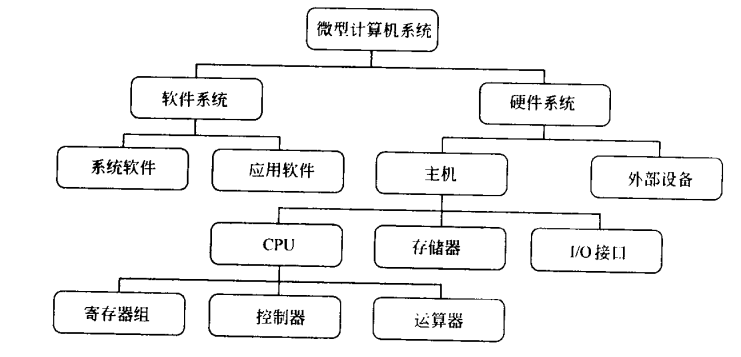
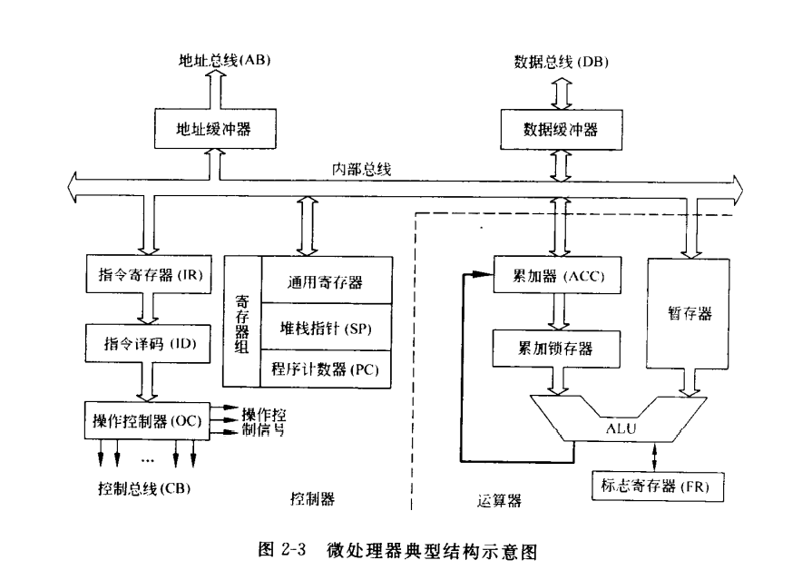
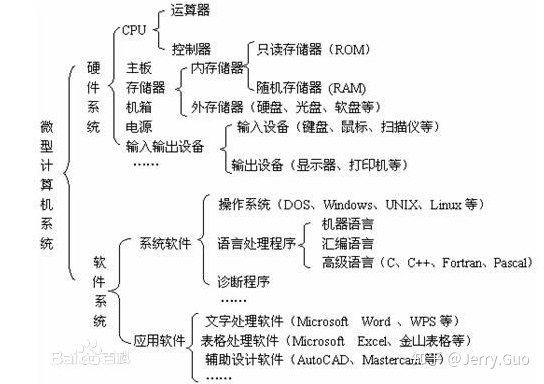
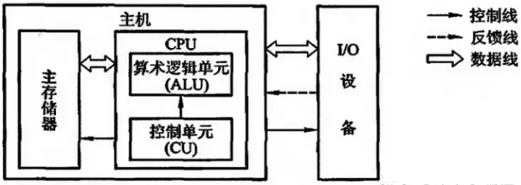
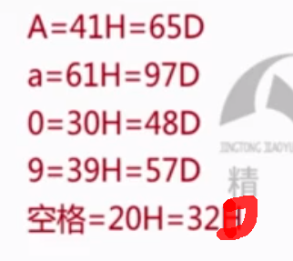
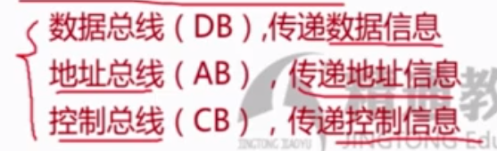

[toc]

# 微型计算机基础

1. 微型计算机的基本组成及各部分的功能与作用
2. 微型计算机的基本工作过程
3. 计算机中对的编码、数制及其转换
4. 无符号二进制数的算数运算和逻辑运算
5. 运算中的溢出
6. 计算数的表示及运算
7. 基本逻辑门及常用逻辑部件

----

## 微型计算机的基本组成

>   微型计算机的基本组成及各部分的功能与作用

- CPU:中央处理器,用于执行指令和运算
- 主存:用于暂存程序和数据
- 外存:用于长期存储,如硬盘
- 总线:用于组件互联,如内存总线和PCIe总线
- 主板:各组件的载体,提供接口
- 电源:为各组件供电
- 外设:输入输出设备,如显示器、鼠标和网络

### CPU

1. 微型计算机的基本工作过程
   - 读取指令:从主存中读取
   - 解码指令:解析并判断其功能
   - 读取操作数:从主存或寄存器中读取
   - 执行指令:进行运算或访问主存/外设
   - 将结果保存:保存到寄存器或主存
   - 更新程序计数器:指向下一条指令地址
   - 重复上述过程:直到程序结束
2. 计算机中对的编码、数制及其转换
   - 二进制、八进制、十进制和十六进制数制
   - 数制之间的转换方法
3. 无符号二进制数的算数运算和逻辑运算
   - 二进制加法、减法、乘法
   - 移位运算:左移和右移
   - 逻辑运算:与、或和非
4. 运算中的溢出
   - 二进制数的有效位和值域
   - 加法和减法溢出
   - 乘法溢出
5. 计算数的表示及运算
   - 定点数:整数和小数
   - 浮点数:科学计数法
   - 整数和浮点数的运算过程
6. 基本逻辑门及常用逻辑部件
   - 与门、或门、非门、异或门
   - 三态门、选择器、译码器和触发器等

- CPU:中央处理器,用于执行指令和运算
  - 主存:用于暂存程序和数据
  - 外存:用于长期存储,如硬盘
  - 总线:用于组件互联,如内存总线和PCIe总线
  - 主板:各组件的载体,提供接口
  - 电源:为各组件供电
  - 外设:输入输出设备,如显示器、鼠标和网络2. 微型计算机的基本工作过程
  - 读取指令:从主存中读取
  - 解码指令:解析并判断其功能
  - 读取操作数:从主存或寄存器中读取
  - 执行指令:进行运算或访问主存/外设
  - 将结果保存:保存到寄存器或主存
  - 更新程序计数器:指向下一条指令地址
  - 重复上述过程:直到程序结束3. 计算机中对的编码、数制及其转换
  - 二进制、八进制、十进制和十六进制数制
  - 数制之间的转换方法4. 无符号二进制数的算数运算和逻辑运算
  - 二进制加法、减法、乘法
  - 移位运算:左移和右移
  - 逻辑运算:与、或和非5. 运算中的溢出
  - 二进制数的有效位和值域
  - 加法和减法溢出
  - 乘法溢出6. 计算数的表示及运算
  - 定点数:整数和小数
  - 浮点数:科学计数法
  - 整数和浮点数的运算过程7. 基本逻辑门及常用逻辑部件
  - 与门、或门、非门、异或门
  - 三态门、选择器、译码器和触发器等

# 寄存器 （CPU的工作原理）

一个典型的CPU由运算器、控制器、寄存器等器件组成，这些器件靠内部总线相连

区别： 

*   内部总线实现CPU内部各个器件之间的联系
*   外部总线实现CPU和主板上其他器件的联系

8086CPU有14个寄存器，他们的名称为：
AX、BX、CX、DX、SI、DI、SP、BP、IP、CS、SS、DS、ES、PSW。

## 通用寄存器

8086CPU所有的寄存器都是16位的，可以存放两个字节。
AX、BX、CX、DX通常来存放一般性数据，被成为通用寄存器。

## 汇编指令

| 指令      | CPU操作                             | 高级语言描述 |
| --------- | ----------------------------------- | ------------ |
| mov ax,18 | 将18送入AX                          | AX = 18      |
| mov ah,78 | 将78送入AH                          | AH = 78      |
| add ax,8  | 将寄存器AX中的数值+8                | AX = AX + 8  |
| mov ax,bx | 将寄存器BX中的数据送入寄存器AX      | AX = BX      |
| add ax,bx | 将AX,BX中的内容相加，结果存放在AX中 | AX = AX + BX |

>   汇编指令不区分大小写

## 物理地址

CPU访问内存单元时，要给出内存单元的地址。所有的内存单元构成的存储空间是一个一维的线性空间。
我们将这个唯一的地址成为物理地址。

### 16位结构的CPU

*   运算器一次最多可以处理16位的数据
*   寄存器的最大宽度为16位
*   寄存器和运算器之间的通路是16位

>   CPU中的相关部件提供两个16位地址，一个成为段地址，另一个称为偏移地址；
>   段地址和偏移地址通过内部总线送入一个称为地址加法器的部件。
>   地址加法器将两个16位地址合并成一个20位地址。
>
>   $物理地址=段地址*16+偏移地址$

CPU可以用不同的段地址和偏移地址形成同一个物理地址。
如果给定一个段地址，仅通过变化偏移地址来进行寻址，最多可以定位64k个内存单元。

>   在8086PC机中，存储单元的地址用两个元素来描述：段地址和偏移地址。
>   “数据在21F60H内存单元中。”对于8086PC机的两种描述：
>
>   1.  数据存在内存2000:1F60单元中。
>   2.  数据存在内存2000段中的1F60H单元中。
>
>   可根据需要，将地址连续、起始地址为16的倍数的伊苏内存单元定义为一个段。

