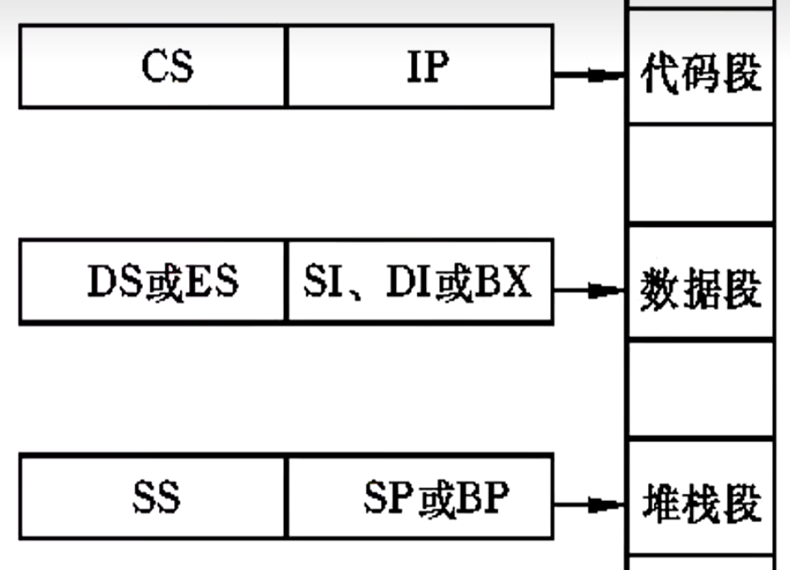

[toc]

# 微处理器与总线

## ==微处理器==

微处理器（CPU）是计算机系统的核心部件，控制和协调整个计算机系统的工作

~~~ mermaid
graph LR
微处理器-->运算器EU
运算器EU-->算术逻辑单元ALU
运算器EU-->通用寄存器
运算器EU-->专用寄存器
微处理器-->控制器
控制器-->程序计数器PC
控制器-->指令寄存器IR
控制器-->指令译码器ID
控制器-->时序控制部件
控制器-->微操作控制部件
微处理器-->内部寄存器
~~~

1.   能够进行算术运算和逻辑运算
2.   能对指令进行译码、寄存并执行指令所规定的操作
3.   具有与存储器和I/O接口进行数据通信的能力
4.   少量的数据暂存
5.   能够提供这个系统所需的定时和控制信号
6.   能够响应输入输出设备发出的中断请求

>   评价CPU性能的指标：
>
>   -   工作频率
>   -   指令系统功能
>   -   内部缓存容量
>   -   字长 (CPU在单位时间内能够一次处理的二进制数位数)
>   -   …
>
>   目前主流的CPU的字长是64位

微处理器内部总体上分为三部分：

1.   运算器
2.   控制器
3.   寄存器组

### 运算器

运算器由算术逻辑单元、通用或专用寄存器组及内部总线三部分组成，其核心功能是实现数据的**算术运算**和**逻辑运算**。 

ALU内部包括负责加减乘除运算的**加法器**以及实现与或非异或等逻辑运算的**逻辑运算部件**。

~~~ mermaid
graph BT
subgraph 逻辑运算单元
	A(逻辑运算功能部件)-->B(加法器)
	A--逻辑运算结果-->B
end
B(加法器)-->C(运算结果)
D(A)-.输入.->A
E(B)-.输入.->A
F[控制信号]-->A
F-->A
B-->G(进位信号)
~~~

### 控制器

控制器的作用是控制程序的执行，它是整个系统的指挥中心

控制器的功能：

*   指令控制
*   时序控制
*   操作控制

控制器的构成

1.   程序计数器：存放下一条要执行指令在存储器中的地址
2.   指令寄存器：存放从存储器中取出的待执行的指令
3.   指令译码器：翻译指令寄存器中的指令
4.   时序控制部件：产生计算机工作中所需的各种时序信号
5.   微操作控制部件：控制器的主体，产生与各条指令相对应的微操作

~~~ mermaid
graph TB
subgraph 控制器
程序计数器 <==> 地址加法器 <==> 指令寄存器 ==> 指令译码 --> 微操作控制
end
自动存储器 ==> 指令寄存器
地址加法器 ==> 至存储器
时序逻辑 --> 微操作控制 -.-> 各部件微操作控制信号

~~~

## 8088/8086微处理器

8088与8086是同时代的微处理器，都属于第三代CPU，他们具有完全相同的指令系统

8088数据总线为8位，8086为16位

### 8088/8086 CPU 的特点

1.   指令流水线
2.   内存分段管理技术
3.   支持多处理器系统

### 8088 CPU 的外部引脚及其功能

8088 和 8086 CPU 都具有40条引出线的集成电路芯片，采用双列直插式封装

为了减少芯片的引线，8088的许多引脚具有双重功能，采用分时复用方式工作，在不同的时刻，这些引线上的信号是不同的

#### 最小模式下的引脚

1.   A~16~ \~ A~19~ / S~3~ \~ S~6~ ：地址、状态复用引脚，三态输出。

2.   A~8~\~A~15~ ：中八位地址信号，三态输出。CPU寻址内存或接口时，这些引脚送出地址A~8~\~A~15~。

3.   AD~0~\~AD~7~ ：地址、数据分时复用的双向信号线，三态。当ALE=1时，这些引脚上传的地址信号；当$\overline{\text{DEN}}$=0时，这些引脚上传输的是数据信号。

4.   IO / $ \overline{\text{M}}$ ：输入输出/存储器控制信号，三态。 IO / $ \overline{\text{M}}$ 输出低电平，访问存储器，输出高电平，访问IO端口。

5.   $ \overline{\text{WR}}$ ：写信号输出，三态。低电平表示CPU正在对存储器或IO端口进行写操作。

6.   DT/ $ \overline{\text{R}}$ ：数据传送方向控制信号，三态。用于确定数据传送的方向。高电平，CPU向存储器或IO端口发送数据；低电平，CPU从存储器或IO端口接受数据。

7.   $\overline{\text{DEN}}$ ：数据允许信号，三态。有效时，表示数据总线上具有有效数据。

8.   ALE：地址锁存信号，三态输出，高电平有效。高电平时，表明CPU地址线上有有效地址。因此，常用作锁存控制信号将A~0~\~A~19~锁存到地址锁存器。

9.   $\overline{\text{RD}}$：读选通信号，三态输出，低电平有效。有效时，表示CPU正在对锁存器或IO接口进行读操作。

10.   READY：外部同步控制输入信号，高电平有效。他是由被访问的内存或IO设备发出的响应信号。有效时，表示存储器或IO设备已准备好，CPU可以进行数据传送。

      >   若READY位低电平，表示存储器或IO设备没有准备好。CPU在T~3~周期采样READY信号，如果是低电平信号，CPU自动插入等待周期T~w~（一个或多个），直到READY变为高电平后，CPU才脱离等待状态，完成数据传送过程。

11.   INTR：可屏蔽中断请求输入信号，高电平有效。CPU在每条指令的最后一个周期采样该信号，以决定是否进入中断响应周期。这个引脚上的中断请求信号可用软件屏蔽。

12.   $\overline{\text{TEST}}$：测试信号输入引脚，低电平有效。当CPU执行WAIT指令时，每隔5个时钟周期对此引脚进行一次测试，若为高电平，CPU则处于空转状态进行等待；当变成低电平时，CPU结束等待，继续执行下一条指令。

13.   NMI：非屏蔽中断请求输入信号，上升沿触发。这个引脚上的中断请求信号不能被软件屏蔽，CPU在当前指令执行结束后就进入中断过程。

14.   RESET系统复位输入信号，高电平有效。为使CPU完成内部复位过程，该信号至少要在4个时钟周期内保持有效。当RESET返回低电平时，CPU将重新启动。

15.   $\overline{\text{INTA}}$：中断响应信号输出，低电平有效。此信号是CPU对中断请求信号INTR的响应。在响应过程中，CPU在$\overline{\text{INTA}}$引脚上连续输出两个负脉冲作用外部中断源的中断向量码的读选通信号。

16.   HOLD：总线保持请求信号输入，高电平有效。当某一总线主控设备要占用系统总线时，通过引脚向CPU提出请求。

17.   HLDA：总线保持响应信号输出，高电平有效。这是CPU对HOLD请求的响应信号，当CPU收到有效的HOLD信号后，就会对其作出响应：一方面使CPU的所有三态输出的地址信号、数据信号和响应的控制信号变为高阻状态(浮动状态)；同时输出一个有效的HLDA，表示处理器现在已放弃对总线的控制。当CPU检测到HOLD信号变低后，就立刻使HLDA变低，同时恢复对总线的控制。

18.   $\overline{SS_0}$ ：系统状态信号输出。它与IO/$\overline{\text{M}}$ 和DT/$\overline{\text{R}}$ 信号决定了最小模式下当前总线的状态。

19.   CLK：时钟信号输入引脚。8088的标准时钟频率为4.77MHz。

20.   V~cc~：5V电源输入引脚。

21.   GND：地线。

~~~ mermaid
graph LR
A[8088/8086]-->B(执行单元 EU)
A-->C(总线接口单元 BIU)
B-->运算器
B-->8个通用寄存器
B-->1个标志寄存器
B-->EU部分控制电路
~~~

 

>   EU执行单元：负责执行指令，分析指令，暂存中间运算结果并保留结果。
>   构成：算术逻辑单元（ALU），通用寄存器，标志寄存器和EU控制电路组成
>
>   BIU总线接口单元：负责CPU与存储器，IO接口之间的信息传递。
>   构成：段寄存器，指令指针寄存器，地址加法器以及总线控制逻辑
>
>   8088指令队列的长度为4，8086指令队列长度为6
>
>   物理地址是唯一的，物理对应的逻辑地址不唯一。

##### S~3~\~S~16~ 输出状态信息

S~6~恒等于0
S~5~指示中断允许标志位IF的状态
S~4~和S~3~组合指示CPU当前使用的段寄存器

| S~4~ | S~3~ | 当前正在使用的段寄存器 |
| :--: | :--: | :--------------------: |
|  0   |  0   |           ES           |
|  0   |  1   |           SS           |
|  1   |  0   | CS或未使用任何段寄存器 |
|  1   |  1   |           DS           |

##### 复位后CPU的内部寄存器的状态

| 内部寄存器 | 内容  |
| :--------: | :---: |
|     CS     | FFFFH |
|     DS     | 0000H |
|     SS     | 0000H |
|     ES     | 0000H |
|     IP     | 0000H |
|   FLAGS    | 0000H |
| 其余寄存器 | 0000H |
|  指令队列  |  空   |

----

## 内部寄存器

~~~ mermaid
graph LR
A(内部寄存器的类型)--> 8个通用寄存器
A--> 4个段寄存器
A--> 2个控制寄存器
subgraph 通用寄存器
8个通用寄存器--->数据寄存器AX,BX,CX,DX
数据寄存器AX,BX,CX,DX-->AX累加器
数据寄存器AX,BX,CX,DX-->BX基址寄存器
数据寄存器AX,BX,CX,DX-->CX计数寄存器
数据寄存器AX,BX,CX,DX-->DX数据寄存器
8个通用寄存器-->地址寄存器-->地址指针寄存器SP,BP
地址寄存器-->变址寄存器SI,DI
地址指针寄存器SP,BP-->SP堆栈指针寄存器
地址指针寄存器SP,BP-->BP基址指针寄存器
变址寄存器SI,DI-->SI源变址寄存器
变址寄存器SI,DI-->DI目标变址寄存器
end
subgraph 控制寄存器
2个控制寄存器-->IP指令指针寄存器
2个控制寄存器-->FLAGS状态标志
end
subgraph 段寄存器
4个段寄存器-->CS代码段寄存器
4个段寄存器-->DS数据段寄存器
4个段寄存器-->SS堆栈段寄存器
4个段寄存器-->ES附加段寄存器
end
~~~

 ~~~ mermaid
 graph LR
 A(通用寄存器)--->数据寄存器AX,BX,CX,DX
 A-->地址寄存器-->地址指针寄存器SP,BP
 地址寄存器-->变址寄存器SI,DI
 地址指针寄存器SP,BP-->SP堆栈指针寄存器
 地址指针寄存器SP,BP-->BP基址指针寄存器
 变址寄存器SI,DI-->SI源变址寄存器
 变址寄存器SI,DI-->DI目标变址寄存器
 ~~~

## 通用寄存器

### 数据寄存器

AX：累加器。所有IO指令都通过AX与接口传送信息，中间运算结果页多放于AX。
BX：基址寄存器。在间接寻之中用于存放基地址。（base）
CX：计数寄存器。用于在循环或串操作指令中存放计数值。（count）
DX：数据寄存器。在间接寻址IO指令中存放IO端口地址；在32位乘除法运算时，存放高16位数。（data）

>   在32位乘除法运算时，AX存放低16位数，DX存放高16位数

#### 地址指针寄存器

SP：堆栈指针寄存器，其内容为栈顶的偏移地址。（Stack Pointer）
BP：基址指针寄存器，常用语在访问内存时存放内存单元的偏移地址。（Base Pointer）

>   作为通用寄存器：BX和BP都可以用来存放数据
>
>   作为基址寄存器：BX表示所寻找的数据在数据段；用BP则表示数据在堆栈段。

#### 变址寄存器

SI：源变址寄存器 （source）
DI：目标变址寄存器 （destination目的地）

变址寄存器在指令中常用于存放数据字内存中的地址。

在 8086 CPU 中，只有 4 个寄存器可以以 […] 的方式使用，这四个寄存器分别是 BX，SI，DI，BP。

## 控制寄存器

~~~ mermaid
graph LR
A(控制寄存器)-->IP指令指针寄存器
A-->FLAGS状态标志
~~~

IP：指令指针寄存器，内容为下一条要执行指令的偏移地址。
FLAGS(flags)：标志寄存器，存放运算结果的特征。

>   标志寄存器一共有16位，但是只有9位有效
>
>   程序不能直接访问IP，但是可以通过某些指令修改IP 的内容。
>
>   指令缓冲队列：BIU从存储器中读出指令送入指令队列，8086的指令队列是6字节，8088是4字节

FLAGS标志位：

*   6个状态标志位（CF，SF，AF，PF，OF，XF）
*   3个控制标志位（IF，TF，DF）

1.   CF（Carry Flag）：进位标志位。加减法运算时，若最高位有进位或借位，则CF=1。
2.   PF（Parity Flag）：奇偶标志位。运算结果的低8位中“1”的个数为偶数时PF=1。
3.   AF（Auxiliary Carry Flag）：辅助进位标志位。加减操作中，若Bit3向Bit4有进位或借位，AF=1。
4.   ZF（Zero Flag）：零标志位。当运算结果为0时ZF=1。
5.   SF（Sign Flag）：符号标志位。当运算结果的最高位为1时，SF=1。
6.   OF（Overflow Flag）：溢出标志位。当算术运算的结果超出了有符号数的可表达范围时，OF=1。
7.   TF（Trap Flag）：陷阱标志位，也叫跟踪标志位。TF=1时，使CPU处于单步执行指令的工作方式。
8.   IF（Interrupt Enable Flag）：中断允许标志位。IF=1时，CPU可以响应可屏蔽中断请求。
9.   DF（DIrection Flag）：方向标志位。在数据串操作时确定操作的方向。

## 段寄存器

~~~ mermaid
graph LR
A(段寄存器)-->CS代码段寄存器
A-->DS数据段寄存器
A-->SS堆栈段寄存器
A-->ES附加段寄存器
~~~

用于存放响应逻辑段的段基地址
8086/8088内存中逻辑段的数量做多为64K

CS：代码段寄存器，存放代码段的段基地址。
DS：数据段寄存器，存放数据段的段基地址。
ES：附加段寄存器，存放数据段的段基地址。
SS：堆栈段寄存器，存放堆栈段的段基地址。

>   段寄存器的值表明响应的逻辑段在内存中的位置
>
>   段基址和段内偏移又叫逻辑地址  xxxxH:yyyyH
>
>   物理地址=段基地址X16+段内偏移

BIU中的地址加法器用来产生20位的物理地址。8088/8086的寄存器都是16位的，无法装载20位的物理地址。所以8086/8088将地址空间分段，将2^20^(1MB)的地址空间划分为若干个64KB的段，然后用段基址加上段内偏移来访问物理存储器。

8086/8088规定，分段总是从16字节的边界处开始，所以段的其实地址最低4位总是0。段基地址实际上是段起始地址的高16位。所以BIU在计算存储器的物理地址时，即是将段基地址左移4位然后与段内偏移地址相加。

| 段首地址(16位基址地址左移4位) |  X   |  X   |  X   |  X   |      |
| ----------------------------: | :--: | :--: | :--: | :--: | :--: |
|                段内偏移(16位) |      |  X   |  X   |  X   |  X   |
|                物理地址(20位) |  X   |  X   |  X   |  X   |  X   |

 8088/8086对段寄存器使用的约定

| 序号 |  内存访问类型  | 默认段寄存器 | 可重设的段寄存器 |     段内偏移地址来源     |
| :--: | :------------: | :----------: | :--------------: | :----------------------: |
|  1   |     取指令     |      CS      |        无        |            IP            |
|  2   |    堆栈操作    |      SS      |        无        |            SP            |
|  3   |  串操作之源串  |      DS      |      ES，SS      |            SI            |
|  4   | 串操作之目标串 |      ES      |        无        |            DI            |
|  5   | BP用作基址寻址 |      SS      |      ES，DS      | 按寻址方式计算得有效地址 |
|  6   |  一般数据存取  |      DS      |      ES，SS      | 按寻址方式计算得有效地址 |

### 工作时序

时钟周期：CPU的一切操作都是在系统主时钟CLK的控制下按节拍的有序进行。   $周期=\frac{1}{频率}$   $1s=1000ms(10^3)=1000000μm(10^6)$   $1000Hz=1kHz$   $10^6=1MHz$

>   $主频=\frac{1}{时钟周期}$

总线周期：CPU通过外部总线对存储器或IO端口进行一次读/写操作的过程。一个总线周期由若干的时钟周期构成。（一般等于4个时钟周期）

## ==总线==

CPU通过总线实现读取指令并实现与内存、外设之间的数据交换。

总线结构的优点：

1.   便于采用模块结构设计方法，简化系统设计。
2.   标准总线可以得到多个厂商的广泛支持，便于生产与之兼容的硬件板卡和软件。
3.   模块结构方式便于系统的扩充和升级。
4.   便于故障诊断和维修，同时也降低了成本。

----

**总线**时一组信号线的集合，是计算机系统各个部件之间传输地址、数据和控制信息的公共通路。物理结构上，总线包括一组导线和相关的控制、驱动电路组成。

### 总线的分类

#### 按传送信息的类型划分

1.   数据总线DB：计算机系统内各个部件之间进行数据传送的路径。（单向）
2.   地址总线AB：传送地址信息。（双向）
3.   控制总线CB：传送各种控制信号。（总体是双向的）

#### 按总线的层次结构划分

1.   前端总线：包括地址总线、数据总线、控制总线，用来实现CPU与主存储器、CPU与IO接口芯片、CPU与控制芯片组等芯片之间的信息传输，也用于系统中多个CPU之间的连接。
2.   系统总线（IO通道总线）：包括地址总线、数据总线、控制总线。是主机系统与外围IO设备之间的通信通道。
3.   外设总线：计算机主机与外部设备接口的总线，实际上是一种外设接口标准。

### 总线的主要性能指标

1.   总线的带宽：单位时间内总线上可传送的数据量，就是常说的MB/s。
2.   总线的位宽：总线能同时传送的数据位数，就是常说的64位。
3.   总线的工作频率：也称为总线的时钟频率（MHz）。指的是用于协调总线上的各种操作的使用信号的频率。

>   $$总线带宽BW=(总线宽度/8)×总线的时钟频率/每隔存取周期的时钟数$$

### 总线的基本功能

1.   总线传输同步（数据传送：1.同步定时方式，异步传输方式）
2.   总线的仲裁控制
3.   错误处理
4.   总线驱动

[x86汇编之——8086寄存器讲解 - 知乎 (zhihu.com)](https://zhuanlan.zhihu.com/p/115915986)
