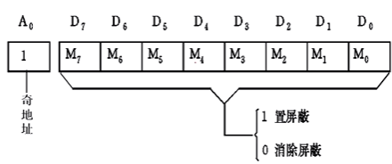
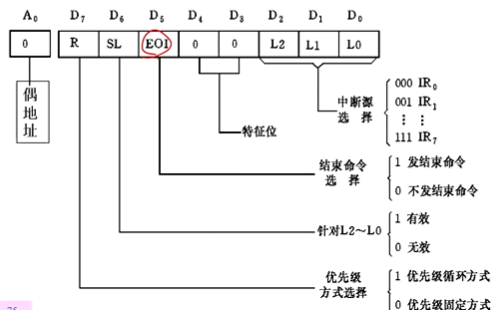
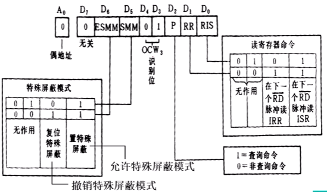

[toc]

>   *   静态随机存储芯片 SRAM-6264
>   *   动态随机存储芯片 DRAM-2164
>   *   译码器 74LS138
>   *   可编程中断控制器 8259A
>   *   计数芯片 8253
>   *   并行接口芯片 8255

# SRAM-6264

1.   芯片的地址译码是A0-A12共13位地址译码电路。
2.   芯片有I/O0-I/O7共八位数据传送线。
3.   所以该芯片是8K*8位的

# DRAM-2164

2164容量为64k*1bit，内部有65536个动态存储单元。整个芯片每2ms刷新一遍，若每次刷新512个存储单元，64k个存储单元需要128个刷新周期。封装时仅将8条地址线引出到芯片外部。

*   A0\~A7：地址线
*   WE：读写控制线，WE=1读，WE=0写
*   RAS：行选通信号
*   CAS：列选通信号
*   D~in~：数据输入
*   D~out~：数据输出
*   V~cc~：+5V
*   GND：地

# 74LS138译码器

3个输入端：A、B、C，C是最高位

3个使能端：G1、G~2A~\\、G~2B~\\，只有他们都满足的时候工作

8个输出端：Y0\\——Y7\\

#### 真值表

#### 电路连接

内存扩展步骤：

1.   在给定的各芯片中选用片内寻址(片内译码)线较多的为基准，提前将这些片内译码线预留出来，直接接入芯片即可。若出现未对齐的问题（如一个为1K一个为2K），则将差出的地址线参与容量较小的芯片的选择译码；
2.   除片内译码线外，将剩余的地址线最低三位接入38译码器的输入端(A,B,C),需要注意的是A为最低为，C为最高位。
3.   将剩余的地址线进行38译码器的选通，为0的地址线过或门接入G2A\\,G2B\\,引脚，为1的地址线过与门接入G1引脚。若地址线不够用，则使G2A\\，G2B\\接地，G1接+5V即可。
4.   若出现1所说的芯片对其问题，在需考虑将未参与译码的地址线参与片选。

# 8259A 可编程中断控制器

Intel 8259A是8086系列CPU兼容的可编程中断控制器，它的主要功能是：

1.   具有8级优先权控制，级联可扩展至64级
2.   每一级中断都可以屏蔽或允许
3.   在中断响应周期，8259A可提供相应的中断向量号(中断类型号)。
4.   8259A的工作方式，可通过编程来进行选择。

*   D~7~——D~0~：数据总线(双向)
*   RD\\：读输入
*   WR\\：写输入
*   A~0~：命令选择地址
*   CS\\：片选
*   CAS~2~——CAS~0~：级联线
*   SP\\——EN\\：从程序/允许缓冲
*   INT：中断输出
*   INTA\\：中断响应输入
*   IR~0~——IR~7~：中断请求输入

## 8259A的编程

### 初始化编程

由CPU向8259A送入2\~4字节的初始化命令字ICW

### 工作方式编程

由CPU向8259A送三个字节的工作命令字OCW，以规定8259A的工作方式。该命令可在8259A初始化命令字ICW后的任何时间写入。

#### ICW1——芯片控制字

#### ICW2——中断类型控制字(中断类型码):star:

#### ICW3——主/从片初始化(级连控制字)

#### ICW4——方式控制字

#### OCW1——屏蔽操作命令字

用来设置或清除对中断的屏蔽(设置IMR的值)

#### OCW2——中断方式命令字

设置优先级循环和中断结束方式

#### OCW3——状态操作命令字

设置和撤销特殊屏蔽方式、设置中断查询方式、设置对8259A内部寄存器的读出命令。

# 计数芯片8253

## 引脚

*   D7\~D0：数据引脚
*   CS\\：片选
*   RD\\：读
*   WR\\：写
*   A1，A0：计数通道或控制寄存器
*   CLK~n~：时钟脉冲输入，计数器的计时基准
*   GATE~n~：门控信号输入，控制计数器的启停
*   OUT~n~：计数器输出信号，不同工作方式下产生不同的波形

## 启动方式

### 软件启动

程序指令启动，GATE端保持为高电平，写入计数器初值后的第2个CLK脉冲的下降沿开始计数

### 硬件启动

外部电路信号启动，GATE端有一个**上升沿**，对应CLK名称的下降沿开始计数

## 控制字

*   用于确定各计数器的工作方式
*   8253必须先初始化才能正常工作
*   每个计数器都必须初始化一次+
*   CPU通过OUT指令把控制字写入控制寄存器

*   接口地址为40H——43H
*   输入8253的时钟频率为1.19MHz
*   计数器0：每秒18.2次输出信号
*   计数器1：每15微秒输出信号
*   计数器2：产生连续方波信号

~~~ assembly
; 写控制字
MOV AL,01110100B;
OUT 43H,AL;
; 送初值
MOV AX,1000;
OUT 41H,AL; 送低8位
MOV AL,AH;  送高8位
OUT 41H,AL;
~~~

## 工作方式

*   方式0：计数结束中断
*   方式1：可重复触发的单稳态触发器
*   方式2：频率发生器
*   方式3：方波发生器
*   方式4：软件触发选通
*   方式5：硬件触发选通

### 方式0 计数结束中断

*   软件启动，不自动重复计数
*   装入控制字后OUT端变低电平
*   计数结束OUT输出高电平

计数过程中，GATE端应保持**高电平**。没写入一次初值计数是一个周期，然后停止计数。OUT端输出是一个约(N+1)T~CLK~宽度的负脉冲。计数过程中可随时修改初值重新开始计数。

### 方式1 单稳态触发器

*   硬件启动，不自动重复计数。
*   装入控制字后OUT端变高电平。
*   计数开始OUT端变为低电平，计数结束后又变高。

门控信号GATE端的跳变触发计数，可重复触发。若下一次GATE上升沿提前到达，则OUT端负脉冲拉宽为两次计数过程之和。

计数过程中写入新初值不影响本次计数。

### 方式2 频率发生器

*   软、硬件启动，**自动重复计数**
*   装入控制字后OUT端变高电平，计数到最后一个CLK时OUT输出负脉冲，并连续重复此过程。
*   GATE为计数的控制信号：GATE变低计数停止，在变高时的下一个CLK下降沿，从初值开始重复计数。
*   每个计数周期结束时(减到1时)，OUT端输出一个T~CLK~宽度的负脉冲。
*   计数过程自动重复进行。
*   计数过程中修改初值不影响本轮计数过程。

### 方式3 方波发生器

*   软、硬件启动，自动重复计数
*   装入控制字后OUT端变高电平
*   然后OUT连续输出对称方波(先高后低)
*   OUT输出方波，前半周期为高，后半周期为低。
*   计数过程中修改初值不影响本半周期计数过程。
*   GATE可以作为计数的控制信号：GATE变低计数停止，在变高时的下一个CLK下降沿，从初值开始重新计数

### 方式4 软件触发选通

*   软件启动，不自动重复计数。
*   装入控制字后输出端变高电平。
*   计数结束输出一个CLK宽度的负脉冲。
*   计数过程中，GATE端应保持高电平。
*   每写入一次初值，计数一个周期，然后停止计数。
*   每个计数周期结束时(减到0时)，OUT端输出一个T~CLK~宽度的负脉冲。
*   计数过程中修改初值不影响本轮计数过程。

### 方式5 硬件触发选通

*   硬件启动，不自动重复计数。
*   OUT端波形与方式4相同
*   写入初值时，GATE端应保持低电平。
*   GATE每出现一次正脉冲，计数一个周期，然后停止计数。
*   每个计数周期结束(减到0时),OUT端输出一个T~CLK~宽度的负脉冲。
*   计数过程中修改初值不影响本轮计数过程。

### 级联eg

要求在OUT0端口的二极管亮5ms，灭5ms，非BCD计数。
在OUT1端口的二极管，若GATE1又脉冲信号时，亮1s就灭。采用BCD计数。
写出完整程序段。

~~~ assembly
; 计数器0 初值2000 方式3
; 计数器1 初值100 方式1 BCD计数
MOV AL,00 11 011 0B;
OUT 43H,AL;
MOV AX,20000;
OUT 40H,AL;
MOV AL,AH;
OUT 40H,AL;

MOV AL,01 11 001 1B;
OUT 43H,AL;
MOV AX,0100H;
MOV AL,AH;
OUT 41H,AL;
~~~

----

# 并行接口芯片 8255

分为3个8位数据端口A、B、C，其中C分为高4位和低4位

A端口输入输出均锁存，数据不易丢失，BC输入不锁存，输出锁存。

>   #### 通常使用方法
>
>   1.   端口A、B作为独立的输入或者输出端口。
>   2.   端口C配合端口A、B。通过方式控制名利分为2个4位端口，传送控制和状态信息。

| A1   | A2   | 端口     |
| ---- | ---- | -------- |
| 0    | 0    | 端口A    |
| 0    | 1    | 端口B    |
| 1    | 0    | 端口C    |
| 1    | 1    | 控制端口 |

>   因为低8位和偶地址端口相连，所以在8086系统中，将8255A的A1、A0引脚分别接向系统总线的A2、A1，并且CPU对8255A的端口进行访问时，应将其地址最低位A0设置为0.

## 8255A 的控制字

根据D7位的状态决定控制字分为两类

1.   各端口的方式选择控制字
2.   C端口按位置1/0控制字

### 方式选择控制字

### 端口C置位/复位控制字(D7=0)

此控制字必须写入8255的控制口。

## 8255A的工作方式

### 方式0——基本输入/输出方式

1.   端口A、端口B、端口C上、下均可作为输入或输出口，且各端口均是独立的。
2.   四个端口的输入或输出，可以有16种不同的组合。
3.   各端口输出时无锁存，输出时锁存。

>   ### 使用场合
>
>   1.   同步传送(无条件传送方式)
>   2.   查询式传送

### 方式1——选通的输入/输出方式

必须利用端口C提供的选通信号和应答信号等

1.   端口A和B要在端口C的配合下工作
2.   端口C中有三位用于端口A的I/O控制，另有三位用于端口B的I/O控制，并且提供中断逻辑。
3.   若只有一个数据端口工作在方式1，则另一个数据端口及端口C余下的五位可以工作与方式0；若两个数据端口都工作于方式1，那么端口C余下的两位可做I/O位，也可进行置位/复位操作。

>   1.   方式2的I/O均为锁存
>   2.   端口A工作于方式2，端口B可工作于方式0或方式1
>   3.   端口C用5各数位提供控制和状态信号

