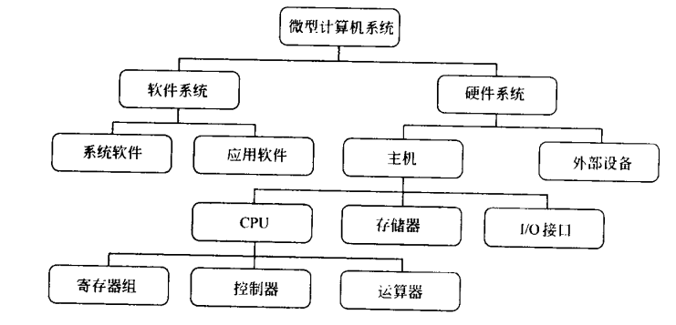
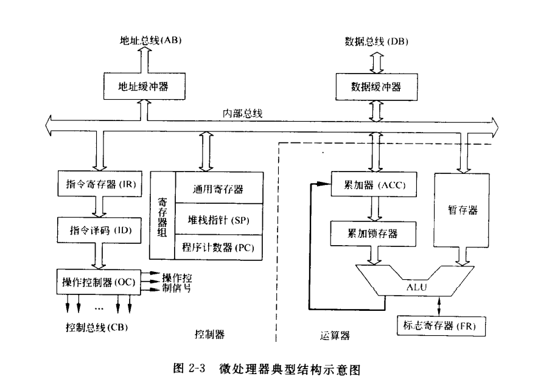

 # 微型计算机基本结构

微型计算机是体积、重量、计算能力都比较小的一类计算机的总称，它一般是供个人使用，所以又称为个人计算机。微型计算机由硬件系统和软件系统两大部分组成，一般把二者构成的系统称为微型计算机系统。

## 微型计算机的概念结构

大的功能结构上：

*   CPU
*   储存器
*   I/O接口
*   I/O设备

各组成部分之间通过地址总线AB，数据总线DB，控制总线CB。统称为系统总线。系统总线是各部件之间传送数据的公共通道。

## 硬件系统

### 微处理器（中央处理单元，CPU）
CPU是微型计算机的核心芯片，是整个系统的运算和指挥控制中心。每种CPU都有其特有的指令系统。

*   运算器 算数逻辑单元，它是以加法器为基础，辅之以移位寄存器及相应控制组合而成的电路。可完成加减乘除四则运算和各种逻辑运算。新型CPU的运算器还可以完成各种浮点计算。
*   控制器 一般由指令寄存器、指令译码器和操作控制电路组成。控制器是整个CPU的指挥控制中心，对协调整个微型计算机有序工作极为重要。从储存器中一次取出程序的各条命令，并根据命令的要求，向微机的哥哥部件发出相应的控制信号，从而实现整个微机系统的控制。
*   寄存组 CPU内部的若干个储存单元。在汇编语言中通常是按名字来访问他们。寄存器分为专用寄存器和通用寄存器。专用寄存器的作用是固定的，如堆栈指针，程序计数器，标志寄存器等通用寄存器的数目因CPU而异，如8086/8088寄存器，CPU中有8各16位的通用寄存器可供程序员使用。

除了上述两类程序员可用的寄存器外，还有一些不能直接使用的寄存器，如累加锁存器，暂存器和指令寄存器等，它们斤仅受内部定时与控制逻辑的控制。

### 储存器

储存器又叫内存或主存，是微型计算机的存储和记忆部件，可以存放数据和当前执行的程序。微型机的内存都属于半导体储存器。

#### 内存单元的地址和内容

内存由许多单元组成，每个内存单元可存放一组二进制数。在微机中规定每个内存单元可存放8位二进制数，即一个字节。每个内存单元都有一个唯一的内存地址，所以CPU要访问内存单元时，可以通过指定的地址来访问他。

#### 内存的操作

CPU对内存的操作有读、写两种。读操作是CPU将内存单元的内容取到CPU内部，而写操作是CPU将内部信息传送到内存单元保存起来。

