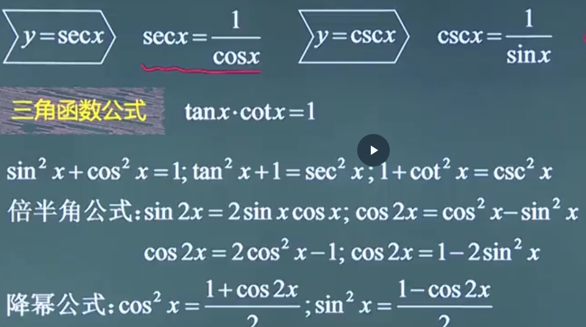
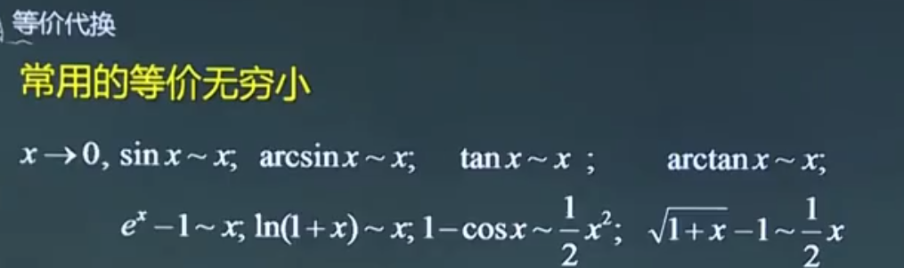

# 函数

## 定义域

1.   分母不为零
2.   偶次方根号下≥0
3.   对数函数真数部分>0
4.   反三角函数$y=arcsinx$，$y=arccosx$中，$|x|≤1$

## 奇偶性

常用奇函数：$y=x$，$y=1/x$，$y=x^3$

常用偶函数：$y=x^2$，$y=cosx$，$y=|x|$

奇+奇=奇，偶+偶=偶

奇×奇=偶，偶×偶=偶，奇×偶=奇

