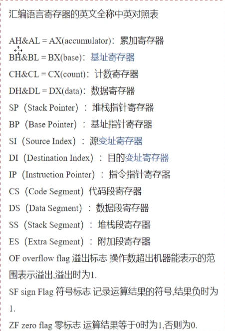

[toc]

*   mov 移动 第二个操作数移动到第一个操作数
*   add 加 第二个操作数加到第一个操作数
*   sub 减 第二个操作数减去第一个操作数

#### mul 乘

mul bl

如果是8位，一个默认放在AL中，另一个放在8位reg或内存字节单元中；如果是16位，一个默认AX中，一个放在16位reg或内存单元中。

计算结果：8位乘法，结果默认放在AX中；如果是16位乘法，结果高位默认放在DX中，低位放在AX中。

#### div 除

如果除数是8位，被除数则为16位，默认在AX中存放；如果除数为16位，被除数则为32位，DX存高16位，AX存放低16位。

计算结果：如果除数为8位，则AL存储商，AH存储余数；如果除数是16位，AX存储商，DX存储余数。

#### and / or 逻辑运算

*   and 按位相与存放到前面的操作数
*   or 按位相或存放到前面的操作数

#### 位移

*   shl 左移运算
*   shr 右移运算
*   rol 循环左移
*   ror 循环右移

**非循环移位指令：**

| 指令 |   名称   | 作用                       |
| :--: | :------: | -------------------------- |
| SAL  | 算数左移 | 最高位移入标志状态位CF     |
| SAR  | 算术右移 | 最低位移入CF，最高位不变。 |
| SHL  | 逻辑左移 | 最高位移入标志状态位CF     |
| SHR  | 逻辑右移 | 最低位移入CF，最高位补0    |

**循环移位指令：**

| 指令 |       名称       | 作用                                                 |
| ---- | :--------------: | :--------------------------------------------------- |
| ROL  |     循环左移     | 不带进位位的循环左移，最高位移入CF和最低位           |
| ROR  |     循环右移     | 不带进位位的循环右移，最低位移入CF和最高位           |
| RCL  | 带进位的循环左移 | 带进位位的循环左移，最高位移入CF，原来的CF进入最低位 |
| RCR  | 带进位的循环右移 | 带进位位的循环右移，最低位移入CF，原来的CF进入最高位 |

#### inc / dec 自增减

*   inc ax 自增1
*   dec ax 自减1

#### xchg 交换指令

xchg AX,BX 两个操作数互换

#### jmp

jmp 1000:3跳转到地址1000:3
jmp bx 跳转到CS为段地址，bx为偏移地址

#### pop / push 栈操作

pop ax;
push [0];  段地址默认DS

>   栈指针  SS:SP

#### cmp 比较

cmp功能相当于减法指令，只是不保存结果。

cmp指令执行后，将对标志寄存器产生影响。其他相关指令通过识别标志寄存器位来得知比较结果

>   cmp 操作对象1,操作对象2

#### je / jne / jb / jnb / ja / jna 对比较结果进行处理

*   je 等于则转移
*   jne 不等于则转移
*   jb 低于则转移
*   jnb 不低于则转移
*   ja 高于则转移
*   jna 不高于则转移

>   bean

*   jmp word ptr
*   jmp dword ptr
*   jcxz   if((cx)==0) jmp short;

#### 跳转到标号处执行执行指令

*   jmp short   实现段内短转移，对IP的修改范围 为-128\~127
*   jmp near    类似于jmp short
*   jmp far       远转移

~~~ assembly
jmp short s
~~~

#### loop 循环

CPU在执行loop指令的时候

1.   (cx)=(cx)-1
2.   判断cx中的值，不为零则转至标号执行程序，如果为零，则向下执行

>   CX中存放循环的次数

~~~ assembly
assume cs:codesg
codesg segment
	mov cx,100;
	s:add bx,cx;
	loop s;
	int 21H;
codesg ends
end
~~~

#### call、ret 函数调用

~~~ assembly
assume cs:codesg
codesg segment
	mov ax,0000H;
	mov bx,0001H;
	call s;
	mov cx,0001H;
	int 21H;
s:	mov ax,bx;
	ret;
codesg ends
end
~~~

#### LEA 取地址指令

LEA ax,[1234H]; 把1234H送AX

将源操作数的有效地址EA送到目的操作数

#### 符号扩展指令 (CBW/CWD)

##### CBW 字节扩展指令(8->16)

格式：CBW

功能：将AL中的数的符号位扩展到AH

规则：若最高位=1，则执行后AH=FFH；若最高位=0，则执行后AH=00H。

##### 字扩展指令(16->32)

格式：CWD

功能：将AX中的数的符号位扩展到DX

规则：若最高位=1，则执行后DX=FFFFH；若最高位=0，则执行后DX=0000H。

>   这两条指令不影响标志位

## 串操作指令

1.   源串一般存放在DS段，偏移地址由SI指出，目标串在ES段，偏移地址由DI指定
2.   每执行一次串操作指令后自动修改指针SI、DI。若方向标志DF=0，则正向，每次串操作后SI和DI自动加1或2；若DF=1，则反向，每次操作后SI和DI自动减1或2修改。
3.   串长（字或字节个数）存放在CX中。

>   在执行指令前，必须DS、ES、SI、DI、DF、CX置好需要的值，他们是串操作指令的隐含操作数。

### 字符串操作指令

#### 字符串传送指令 MOVS / MOVSB / MOVSW

把位于数据段由SI指定的内存单元的字节/字数据传送到附加段由DI指定的内存单元，指令不影响状态标志位。

>   串传送指令常与无条件重复前缀连用

#### 字符串比较指令 CPMS / CMPSB / SMPSW

把位于数据段由SI 指定的字节/字数据与附加段由DI 指定的字节/字数据进行比较，结果不保存，但影响状态标志位，并由DF状态决定SI 、DI 的修改方向。

>   串比较指令常与条件前缀连用，指令的执行不改变操作数，仅影响标志位。

#### 字符串搜索指令 SCAS / SCASB / SCASW

把AL/AX中的内容与附加段由DI指定的一个字节/字数据进行比较，结果不保存，但影响状态标志位，并由DF状态决定DI的修改方向。

### 重复前缀指令

#### 无条件重复 REP

若CX!=0,则<-CX-1继续重复操作，直到CX=0为止

#### 相等/为零重复 REPE / REPZ

若CX!=0且ZF=1，则CX<-CX-1继续重复操作，直到CX=0或ZF=0为止

#### 不相等/不为零重复 REPNE / REPNZ

若CX!=0且ZF=0，在CX<-CX-1继续重复操作，直到CX=0或ZF=1为止

#### DF 置为 1/0

CLD DF = 0

STD DF = 1

## 程序控制指令

### 无条件转移指令 JMP

无条件地将控制转移到目标地址去

#### 段内转移指令

| 段内直接短转移 | JMP SHORT OP    | -128~127     |
| -------------- | --------------- | ------------ |
| 段内直接近转移 | JMP NEAR PTR OP | -32678~32767 |
| 段内间接转移   | JMP WORD PTR OP |              |
|                | JMP OP          |              |

>   当目标地址高于源地址时称为正向转移，偏移量是正数；
>   当目标地址低于源地址时成为反向转移，偏移量是负数。

#### 段间转移指令

| 段间直接转移(远转移) | JMP FAR PTR OP   |
| -------------------- | ---------------- |
| 段间间接转移         | JMP DWORD PTR OP |

### 调用和返回指令 CALL RET

#### 调用指令 CALL

将CALl指令的下一条指令的地址(断点地址)IP或IP与CS压栈，新的目标地址(子程序地址)装入IP或IP与CS中，控制程序转移到由OP指明的子程序入口。其中，OP为子程序的名称。

段内调用：CALL NEAR PROC

段间调用：CALL FAR PROC

#### 返回指令 RET

通常作为一个子程序的最后一条指令，用以返回到调用子程序的断点处，即从堆栈弹出断点送IP和CS。

### 条件跳转指令

#### 对无符号数

| 高于/不低于也不等于转移 | JA/JNBE |
| ----------------------- | ------- |
| 高于或等于/不低于转移   | JAE/JNB |
| 低于/不高于也不等于转移 | JB/JNAE |
| 低于或等于/不高于转移   | JBE/JNA |

>   A->大于
>
>   B->小于
>
>   E->等于
>
>   N->NOT

#### 对有符号数

| 大于/不小于也不等于转移 | JG/JNLE |
| ----------------------- | ------- |
| 大于或等于/不小于转移   | JGE/JNL |
| 小于/不大于也不等于转移 | JL/JNGE |
| 小于或等于/不大于转移   | JLE/JNG |

>   G->大于
>
>   L->小于

#### 对标志位

| 进位为1转移              | JC      | CF=1 |
| ------------------------ | ------- | ---- |
| 进位为0转移              | JNC     | CF=0 |
| 等于/结果为0转移         | JZ/JE   | ZF=1 |
| 不等于/结果不为0转移     | JNZ/JNE | ZF=0 |
| 溢出转移                 | JO      | OF=1 |
| 不溢出转移               | JNO     | OF=0 |
| 奇偶位为0/奇偶性为奇转移 | JNP/JPO | PF=0 |
| 奇偶位为1/奇偶性为偶转移 | JP/JPE  | PF=1 |
| 符号标志位为0转移        | JNS     | SF=0 |
| 符号标志位为1转移        | JS      | SF=1 |

### 循环控制指令

使用循环控制指令之前，必须在CX中预置循环次数的初值。

不影响状态标志位，只要用于数据块比较，查找关键字等操作。

| 计数循环         | LOOP          | CX=0退出                 |
| ---------------- | ------------- | ------------------------ |
| 结果为0/相等循环 | LOOPZ/LOOPE   | CX!=0或ZF=1转移          |
| 结果不为0/不相等 | LOOPNZ/LOOPNE | CX!=0或ZF=0转移          |
| 计数为0转移      | JCXZ          | CX=0时转移，否则顺序执行 |

>   Z->为零
>
>   E->相等
>
>   N->NOT

## 处理器控制指令

### 标志操作指令

| CLC  | CF=0                       |
| ---- | -------------------------- |
| STC  | CF=1                       |
| CMC  | CF=$ \overline{\text{CF}}$ |
| CLD  | DF=0                       |
| STD  | DF=1                       |
| CLI  | IF=0                       |
| STI  | IF=1                       |

### CPU控制指令

#### 处理器暂停指令 HLT

使处理器处于暂时停机状态。

>   HLT引起的暂停，只有RESET(复位)、NMI(非屏蔽中断请求)、INTR(可屏蔽中断请求)信号可以使CPU退出暂停状态

#### 处理器等待指令 WAIT

执行WAIT指令后，处理器处于等待状态，知道检测到$ \overline{\text{TEST}}$引脚有效，到退出等待状态，执行后续指令

>   用于处理器与外设同步

#### 空操作指令 NOP

在执行指令期间，CPU不完成任何操作，只是每执行一套NOP指令，耗费3个时钟周期的时间。

## 输入输出指令

CPU对外设端口由两种寻址方式，即直接寻址和间接寻址。直接寻址范围00H——0FFH个端口；间接寻址范围为0000H——0FFFFH共64K个端口。**间接寻址时，只能用DX作为间址寄存器**

#### 输入指令 IN

IN 累加器, 端口

把一个字节/字由输入端口传入到AL/AX中

~~~ assembly
IN AL,21H;
MOV DX,201H;
IN AX,DX;
~~~

#### 输出指令 OUT

OUT 端口, 累加器

把AX中的16位数或AL中的8位数输出到指定端口。

## 中断指令

#### 溢出中断指令 INTO

检测OF标志位。当OF=1时，产生一个中断类型为4的中断；当OF=0时，指令不起作用。

>   影响标志位IF、TF

#### 软中断指令 INT n

INT n (n为中断类型号)

产生一个软件中断，把控制转向一个类型号为n的软中断。

>   影响标志位IF、TF

#### 中断返回指令 INTR

让CPU执行完中断服务程序后，正确返回原程序的断点处。
