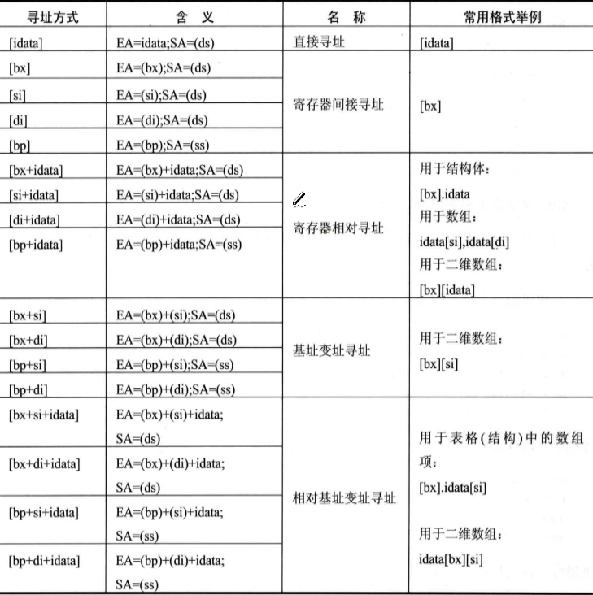

# 内存

8086PC中，内存地址由段地址和偏移地址组成。可以用DS寄存器来存放要访问数据的段地址。

~~~ assembly
mov bx,1000H
mov ds,bx
mov al,[0]
~~~

>   高地址存放高8位，低地址存放低8位

# 特殊寄存器

## BX

可以用来作为偏移地址

~~~ assembly
mov ax,[bx];
mov ax,[bx+1];
~~~

## SI 、DI

SI和DI与BX功能相近，但SI和DI不能分成两个8位寄存器。

~~~ assembly
mov bx,0
mov ax,[bx]
mov ax,[si+1]
mov ax,[di+2]
~~~

## BP

BP与BX功能相近，但是BX段地址默认用DS，BP段地址默认用SS。

>   SI和DI、BX和BP两个只能用一个

>   只有SI,DI,BX,BP可以作为间址寄存器
>
>   使用BX，BP是基址寻址
>
>   使用SI，DI是变址寻址
>
>   有偏移量是相对寻址
>
>   BP的段地址默认是SS
>
>   如果Mov AX,[BP+SI];以基址寄存器为准，使用SS段作为段地址
>
>   基址只能用一个，变址也只能用一个

>   不允许把立即数作为操作数，也不允许向段寄存器送立即数
>
>   不允许在段寄存器之间，存储器之间传送数据
>
>   CS，IP寄存器不能用作目的操作数，IP不允许读写
>
>   一般传送指令不影响标志位

