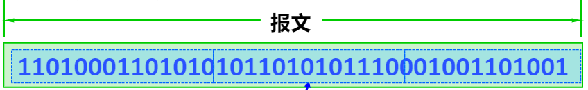
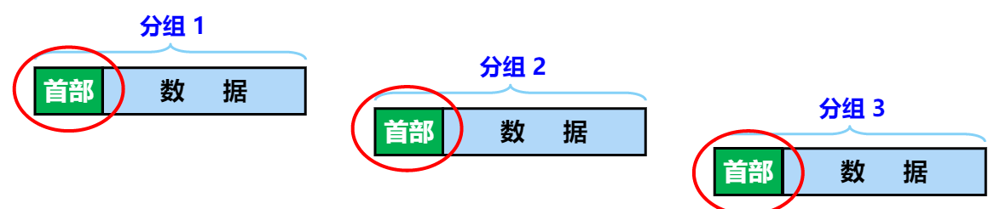
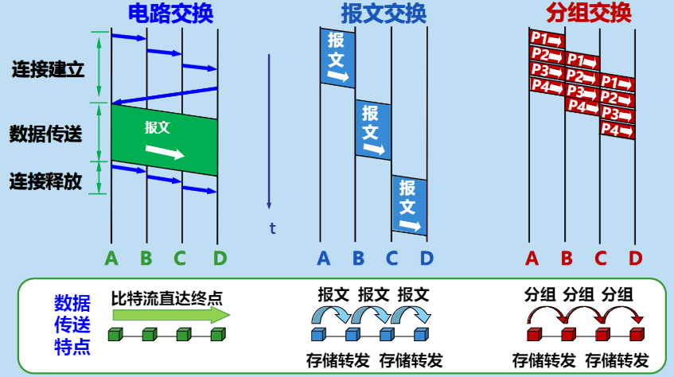

<!-- MarkdownTOC style="ordered" autolink="true" -->

1. [01 计算机网络](#01-%E8%AE%A1%E7%AE%97%E6%9C%BA%E7%BD%91%E7%BB%9C)
    1. [计算机网络的类别](#%E8%AE%A1%E7%AE%97%E6%9C%BA%E7%BD%91%E7%BB%9C%E7%9A%84%E7%B1%BB%E5%88%AB)
        1. [按照网络的作用范围分类](#%E6%8C%89%E7%85%A7%E7%BD%91%E7%BB%9C%E7%9A%84%E4%BD%9C%E7%94%A8%E8%8C%83%E5%9B%B4%E5%88%86%E7%B1%BB)
        1. [按照网络的使用者进行分类](#%E6%8C%89%E7%85%A7%E7%BD%91%E7%BB%9C%E7%9A%84%E4%BD%BF%E7%94%A8%E8%80%85%E8%BF%9B%E8%A1%8C%E5%88%86%E7%B1%BB)
        1. [用来把用户接入到互联网中的网络](#%E7%94%A8%E6%9D%A5%E6%8A%8A%E7%94%A8%E6%88%B7%E6%8E%A5%E5%85%A5%E5%88%B0%E4%BA%92%E8%81%94%E7%BD%91%E4%B8%AD%E7%9A%84%E7%BD%91%E7%BB%9C)
        1. [端系统之间的两种通信方式](#%E7%AB%AF%E7%B3%BB%E7%BB%9F%E4%B9%8B%E9%97%B4%E7%9A%84%E4%B8%A4%E7%A7%8D%E9%80%9A%E4%BF%A1%E6%96%B9%E5%BC%8F)
            1. [C/S](#cs)
            1. [B/S](#bs)
    1. [互联网核心部分的工作原理](#%E4%BA%92%E8%81%94%E7%BD%91%E6%A0%B8%E5%BF%83%E9%83%A8%E5%88%86%E7%9A%84%E5%B7%A5%E4%BD%9C%E5%8E%9F%E7%90%86)
        1. [电路交换](#%E7%94%B5%E8%B7%AF%E4%BA%A4%E6%8D%A2)
        1. [分组交换:star:](#%E5%88%86%E7%BB%84%E4%BA%A4%E6%8D%A2star)
                1. [分组交换带来地问题](#%E5%88%86%E7%BB%84%E4%BA%A4%E6%8D%A2%E5%B8%A6%E6%9D%A5%E5%9C%B0%E9%97%AE%E9%A2%98)
        1. [报文交换](#%E6%8A%A5%E6%96%87%E4%BA%A4%E6%8D%A2)
    1. [三种交换的区别](#%E4%B8%89%E7%A7%8D%E4%BA%A4%E6%8D%A2%E7%9A%84%E5%8C%BA%E5%88%AB)
    1. [计算机网络的性能指标](#%E8%AE%A1%E7%AE%97%E6%9C%BA%E7%BD%91%E7%BB%9C%E7%9A%84%E6%80%A7%E8%83%BD%E6%8C%87%E6%A0%87)
        1. [速率](#%E9%80%9F%E7%8E%87)
        1. [带宽](#%E5%B8%A6%E5%AE%BD)
        1. [吞吐量](#%E5%90%9E%E5%90%90%E9%87%8F)
        1. [时延](#%E6%97%B6%E5%BB%B6)
            1. [发送延迟](#%E5%8F%91%E9%80%81%E5%BB%B6%E8%BF%9F)
            1. [传播延迟](#%E4%BC%A0%E6%92%AD%E5%BB%B6%E8%BF%9F)
            1. [处理延迟](#%E5%A4%84%E7%90%86%E5%BB%B6%E8%BF%9F)
            1. [排队延迟](#%E6%8E%92%E9%98%9F%E5%BB%B6%E8%BF%9F)
            1. [时延带宽积](#%E6%97%B6%E5%BB%B6%E5%B8%A6%E5%AE%BD%E7%A7%AF)
            1. [往返时间](#%E5%BE%80%E8%BF%94%E6%97%B6%E9%97%B4)
            1. [利用率](#%E5%88%A9%E7%94%A8%E7%8E%87)

<!-- /MarkdownTOC -->

# 01 计算机网络

网络是把人或物联系在一起形成的系统。互联网是许多我努力过通过路由器互连而成。互联网是网络的网络。

计算机网络将不同地理位置上具有独立工作能力的计算机、终端及其附属设备用网络设备和通信线路连接起来，并配置网络软件，用来实现数据传输和资源共享的系统。

*   电信网络：电话、电报等服务。
*   有线电视网络：电视节目。
*   计算机网络：数据文件。

## 计算机网络的类别

*   按照网络的作用范围进行分类
*   按照网络的使用者进行分类
*   用来把用户接入到互联网的网络

### 按照网络的作用范围分类

个人局域网PAN、局域网LAN、城域网MAN、广域网MAN

### 按照网络的使用者进行分类

*   公用网络：按规定缴纳费用的人都可以使用网络
*   专用网络：为特殊业务工作的需要而建立的网络

### 用来把用户接入到互联网中的网络

接入网AN，又称为本地接入网或居民接入网。接入网是一类比较特殊的计算机网络，用于将用户接入到互联网。

### 端系统之间的两种通信方式

*   客户-服务器方式（C/S方式）
*   对等方式（P2P）

#### C/S

客户端向服务器请求服务，服务器给客户端提供服务

#### B/S

多台主机直接进行连接

## 互联网核心部分的工作原理

`路由器`是实现**分组交换**的关键构件，其任务是转发收到的分组，**分组转发**是网络核心最重要的功能。

### 电路交换

`交换`就是转接，就是按照某种方式**动态的分配**传输线路的资源。

>   电路交换铜线双方必须先建立连接
>
>   电路交换分为三个阶段
>
>   *   建立连接
>   *   通信
>   *   释放连接

### 分组交换:star:

在发送端，先把较长的报文分成**较短的、固定长度的数据段**，然后在每个数据段前面加上**首部**构成**分组**。

>   分组交换网以*分组*作为数据传输单元。
>
>   *依次*把各个分组发送到接收端
>
>   接收到分组后剥去首部还原报文
>
>   分组交换采用***储存转发***技术。

| 优点 | 采用的手段                                                   |
| ---- | ------------------------------------------------------------ |
| 高效 | 在分组传输过程中动态分配传输宽带，对数据链路是逐段占用       |
| 灵活 | 为每一个分组独立地选择最适合地转发路由                       |
| 迅速 | 以分组作为传送单位，可以不先建立连接就能向其他主机发送分组   |
| 可靠 | 保证可靠性地网络协议；分布式多路由地分组交换网，使网络有很好的生存性。 |

##### 分组交换带来地问题

1.  分组在各节点储存抓发时需要排队，这就会造成一定的时延。
2.  分组必须携带首部，造成了一定的开销。

### 报文交换

报文交换的时延比较长，从几分钟到几小时不等。

## 三种交换的区别

## 计算机网络的性能指标

### 速率

速率是计算机网络中最重要的一个性能指标，指的是数据传送的速率，也成为**数据率**或**比特率**。

速率的单位是bit/s，kbit/s，mbit/s，gbit/s等。

速率往往是指额定速率或标称速率，非世界运行速率。

### 带宽

带宽有两种不同的意义

1.  `带宽`（bandwidth）本来是指信号具有的频带宽度，其单位指赫。
2.  在计算机网络中，带宽是用来表示网络中某通道传送数据的能力。表示在单位时间内网络中的通信道能通过的最高数据率。单位是bit/s，即**比特每秒**。

### 吞吐量

吞吐量表示在单位时间内通过某个网络（或信道、接口）的数据量。

吞吐量受网络的带宽或网络的额定速率的限制。

### 时延

*   时延是指数据（一个报文或分组，甚至比特）从网络（或链路）的一段传送到另一端所需的时间。
*   又是也成为延迟。
*   网络中的延迟由以下几个不同的部分组成：
    *   发送延迟
    *   传播延迟
    *   处理延迟
    *   排队延迟

#### 发送延迟

发送数据时，数据帧从节点进入到传输媒体所需的时间。

也就是从发送数据帧的第一个比特算起，到该帧的最后一个比特发送完毕所需的时间。
$$
发送时延=数据帧长度(bit)/发送速率(bit/s)
$$

#### 传播延迟

电磁波在信道中需要传播一定的距离所需要的时间。
$$
传播延迟=信道长度(米)/信号在信道上传播速率(米/s)
$$

#### 处理延迟

主机或路由器在收到分组时，为处理分组（例如分析首部，提取数据，差错检验或查找路由）所花费的时间。

#### 排队延迟

分组在路由器输入输出队列中排队的能带处理所经历的延迟。

排队延迟的长短往往去救鳄鱼网络中当时的通信量。
$$
总延迟=发送延迟+传播延迟+处理延迟+排队延迟
$$

#### 时延带宽积

链路的时延带宽积又称为i以比特为单位的链路长度。
$$
时延带宽积=传播时延*带宽
$$

#### 往返时间

往返时间RTT表示从发送方发送数据开始，到发送方收到来自接收方的确认，总经历的时间。

#### 利用率

分为信道利用率和网络利用率

