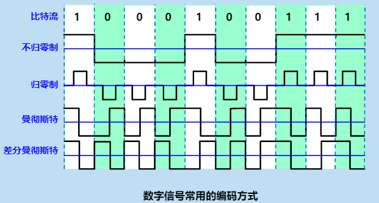

# 03 物理层

## 物理层的功能和特性

物理层考虑的是怎样才能在连接各种计算机的**传输媒体上的传输数据比特流，而不是指具体的传输媒体。**

物理层的作用是要尽可能地**屏蔽**掉不同传输媒体和通信手段地差异。使物理层上面地数据链路层感觉不道这些差异，这样就可使数据链路层只考虑如何完成本层地协议和服务，而不必考虑网络具体地传输媒体和通信手段是什么。

哟关于物理层地协议称为物理成**规程**。

### 物理层的主要任务

确定与传输媒体的接口的一些特性。

>   机械特性：指明接口所用接线器的形状和尺寸、引线数目和排列、固定和锁定装置等。
>
>   电器特性：指明在接口线缆的各条线上出现的电压的范围。
>
>   功能特性：指明某条线上出现的某一电平的电压的意义。
>
>   过程特性：指明对于不同功能的各种可能事件的出现的顺序。

#### 术语

*   数据：运送消息的实体。
*   信号：数据的电气的或电磁的表现。
*   模拟信号：代表消息的参数的取值是连续的。
*   数字信号：代表信息的参数是离散的。
*   码元：在使用时间域的波形表示数字信号时，代表不同离散数值的基本波形。

## 数据通信基础

*   信道：一般用来表示向某一方向传送信息的媒体。
*   单项通信（单工通信）：只能由一个方向通信而没有反方向的交互。
*   双向交替通信（半双工通信）：通信的双方都可以发送信息，但不能双方同时发送。
*   双向同事通信（全双工通信）：通信的双方可以同时发送和接收信息。
*   基带信号：来自信源的信号。像计算机输出的代表各种文字或图像文件的数据信号都属于基带信号。
*   基带信号往往包含较多的低频成分，甚至有直流成分，而许多信道并不能传输这种低频分量或直流分量。因此必须对基带信号进行调制。

##### 调制

*   基带调制：仅对基带信号的波形进行变换，使它能够与信道特性相适应。**变换后的信号时基带信号**。把这种过程称为编码。
*   带通调制：使用载波进行调制，把基带信号的频率范围搬移到较高的频段，并转换为模拟信号，这样就能更好的在模拟信号中传输。
*   带通信号：经过载波调制后的信号。

##### 常用编码的方式

*   不归零制：正电平代表1，负电平代表0
*   归零制：正脉冲代表1，负脉冲代表0
*   曼彻斯特编码：位周期中心的向上跳变代表0，位周期中心向下跳变代表1.但也可反过来定义。
*   差分曼彻斯特编码：每一位的中心处始终有跳变。位开始边界有跳变代表0，而位开始边界没有跳变代表1.

## 物理层下面的传输媒体

传说古媒体也成为传输介质或传输媒介，他就是数据出传输系统中在发送器和接收器之间的物理通道。

传输媒体可以分为两大类：导引型传输媒体、非导引型传输媒体

在导引型传输媒体中，电磁波被导引沿着固体媒介（铜线或光纤）传播。

非导引型传输媒体就是指自由空间。在非导引型传输媒体中，电磁波的传输常称为无线传输。

### 导引型传输媒体

#### 双绞线

*   最常用的传输媒体
*   模拟传输和数字传输都可以使用双绞线，其通信距离一般为几到十几公里。
*   屏蔽双绞线STP
*   带金属屏蔽层
*   无屏蔽双绞线UTP

#### 同轴电缆

*   同轴电缆有良好的抗干扰特性，被广泛用于传输较高速率的数据。
*   同轴点燃的带宽取决于电缆的质量。

#### 光缆

*   光纤时光纤通信的传输媒体。
*   由于可监管的频率非常高，因此一个光纤通信系统的传输带宽远远大于其他各种传输媒体的带宽

当光纤冲高折射率的媒体向低折射率的媒体时，其折射角将大于入射角。因此，如果入射角足够大，就会出现全反射，光也就沿着光纤传输下去。

只要从纤芯中射到纤芯表面的光线的入射角大于某个临界角度，就可以产生全反射。

