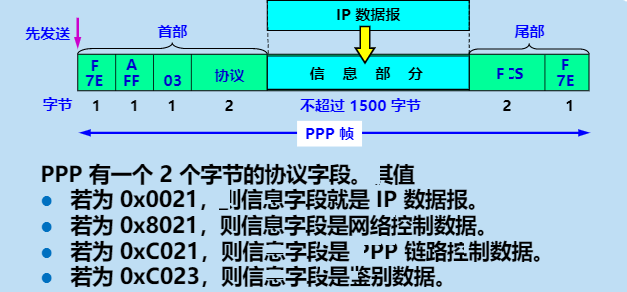

# 数据链路层功能及其核心协议

## 数据链路的帧

链路是一条==无源的点到点的物理线路段==，中间没有任何其他的交换节点。一条链路只是一条通路的一个组成部分

数据链路除了物理线路外，还必须有通信协议来控制这些数据的传输。若把实现这些西医的硬件和软件加到链路上，就构成了数据链路。

1.  现在最常用的方法是使用适配器（即网卡）来实现这些协议的硬件和软件。
2.  一般的适配器都包括了数据链路层和物理成这两层的功能

>   数据链路层协议有多种，担忧三个基本问题则是共同的：
>
>   1.  封装成帧
>   2.  透明传输
>   3.  差错检测

### 封装成帧

在一段数据的前后分别添加首部和尾部，然后就构成了一个帧。

首部和尾部的一个重要的作用就是进行帧定界。

帧定界可以使用特殊的帧定界符

控制字符SOH放在一帧的最前面，表示帧的首部开始。另一个控制字符EOT表示帧的结束。

### 透明传输

吐过数据中的某个字节的二进制代码恰好和SOH或EOT一样，数据链路层就会错误地找到帧地边界

解决方法：字节填充或字符填充

发送端地数据链路层在数据中出现控制字符SOH或EOT地前面插入一个转移字符ESC（其十六进制编码是1B）

接收端地数据链路层在将数据送往网络层之前删除插入地转移字符。

如果转移字符也出现在数据当中，那么英寸在转义字符前面出啊如一个转移字符ESC。当接收端收到连续地两个转义字符时，就会删除其中前面一个。

### 差错检测

在传输过程中可能会产生比特差错：1可能会变成0，0也可能变成1。

为了保证数据传输地可靠性，在计算机网络传输数据时，必须采用各种差错检测措施

在数据链路层传送帧中，广泛使用了==**循环冗余检测CRC**==地检错技术。

>   在发送端，先把数据划分位组。假定魅族k个比特。
>
>   在每组M后面添加供差错检测用地n位**冗余码**，然后一起发送出去。
>
>   若得出地余数R=0，则判定这个帧没有差错，就接受
>
>   若余数R=!0,则判定这个帧有差错，就丢弃。

#### CRC和FCSS不同

1.  CRC时一种常用的检错方法，而FCS时添加在数据后面的荣誉码。
2.  FCS可以用CRC这种方法得出，但CRC并非获得FCS的唯一方法。

## PPP对点信道协议

对于点对点的链路，目前使用的最广泛的数据链路层协议是==点对点协议PPP==

### PPP协议应满足的需求

*   ==简单== **这是首要的要求**
*   封装成帧：必须规定特殊的字符作为帧定界符
*   透明性：必须保证数据传输的透明性
*   多种网络层协议：能够在同一条物理链路上同时支持多种网络层协议。
*   多种类型链路：能够在多种类型的链路上运行。
*   差错检测：能够对接受端收到的帧进行检测，并立即丢弃有差错的帧。
*   检测连接状态：能够及时自动检测出链路是否处于正常工作状态。
*   最大传送单元：必须对每一种类型的点对点链路设置最大传送单元MTU的标砖默认值，出金各种实现之间的互操作性。
*   网络层地址协商：必须提供一种机制使通信的两个网络层实体能够通过协商知道或能够配置彼此的网络层地址。
*   数据压缩协商：必须提供一种方法来协商使用数据压缩算法。

### PPP协议的组成

1.  一个将IP数据报封装到串行链路的方法。
2.  链路控制协议`LCP`
3.  网络控制协议``HCP`

#### 透明传输问题

当PPP用异步传输时，就使用一种特殊的==字符填充法==。

当PPP用在同步传输链路时，协议规定采用硬件类完成==比特填充==

## CSMA/CD协议

最初的以太网是将许多计算机都连接到一根线上。易于实现**广播通信**。当初认为这样的连接方法既简单又可靠，因为总线上没有源器件。

为了实现<kbd>一对一</kbd>通信，将接收站的硬件地址写入帧首部中的**目的地址**字段中。仅当数据帧中的目的地址与适配器的硬件地址一致时，才能接收这个数据帧。

## MAC层的硬件地址

在局域网中，**硬件地址**又称为**物理地址**，或**MAC地址**。

802标准所说的地址严格的讲应当时每一个站的**名字**或**标识符**。

### 48位的MAC地址

IEEE的注册人管理机构RA负责向厂家分配地址字段6个字节中的前三个字节（即最高24位），称为**组织唯一标识符**。

地址字段6个字节中的后三个字节（即低位24位）由厂家自行指派，称为**扩展唯一标识符**，==必须保证生产出的适配器没有重复的地址====

