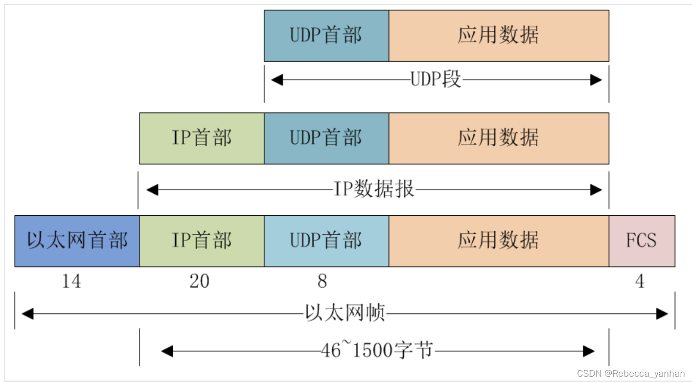

[toc]

# Ethernet II

Ethernet II 是最常见的以太网帧格式，用于局域网(LAN)中的数据链路层传输。

## 数据包

~~~ apl
Ethernet II, Src: Intel_ee:22:30 (dc:21:48:ee:22:30), Dst: c2:79:2b:ec:64:bb (c2:79:2b:ec:64:bb)
    Destination: c2:79:2b:ec:64:bb (c2:79:2b:ec:64:bb)
    Source: Intel_ee:22:30 (dc:21:48:ee:22:30)
    Type: IPv4 (0x0800)
    [Stream index: 0]
~~~

* Destination：目标MAC  6字节
* Source：源MAC  6字节
* Type：类型  2字节
* FCS(隐藏)：帧检验序列 4字节

MTU：默认最大传输单元(1500字节),这是数据部分的最大长度(不包括首部)。

> [!tip]
>
> Type
>
> * 0000-05DC：IEEE802.3
> * 0800：IP协议
> * 0806：ARP协议
> * 0800：IPv4
> * 86DD：IPv6

