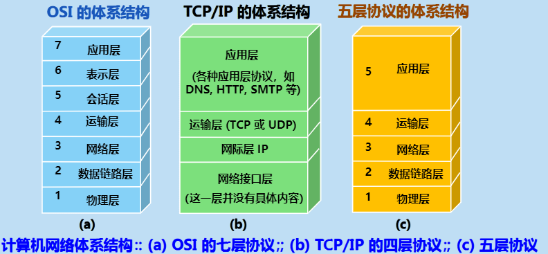
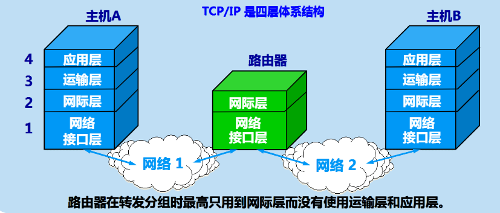
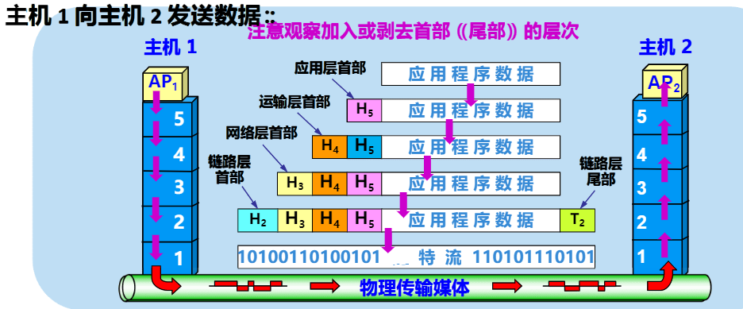
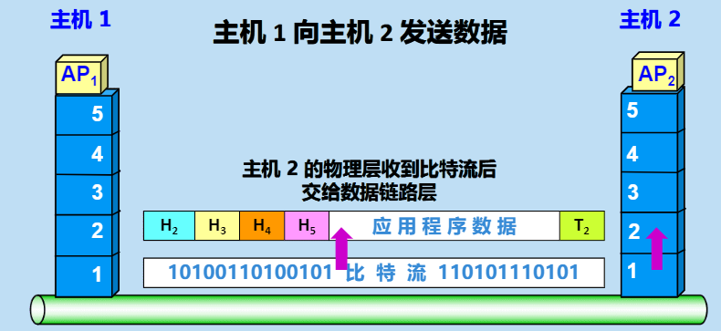
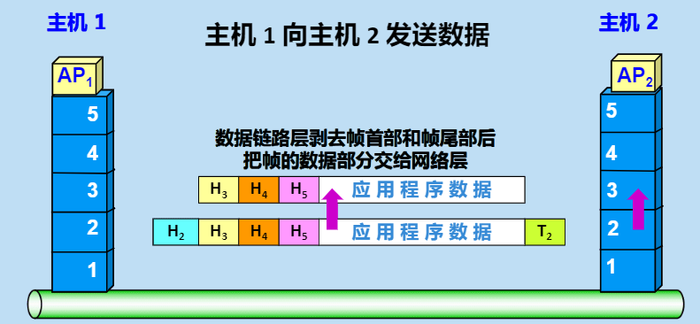
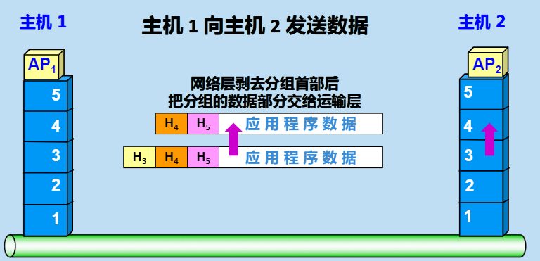
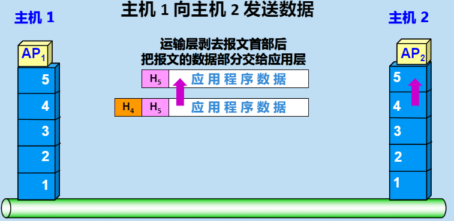
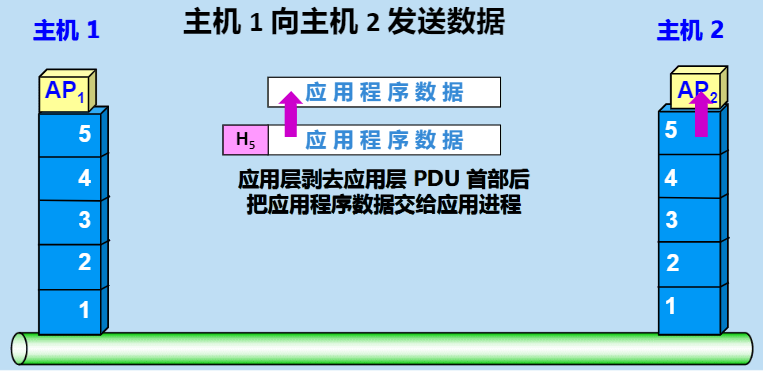
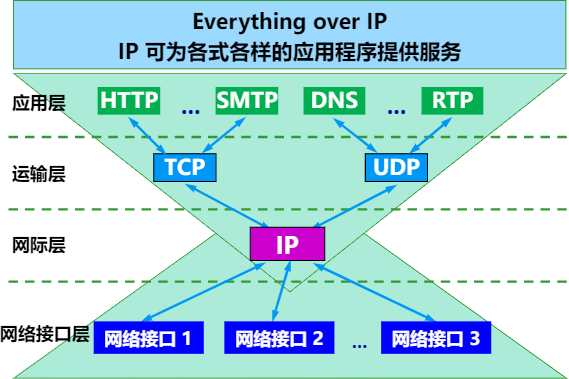

# 02 计算机网络体系结构

计算机网络是个非常庞大、复杂的系统。

互联网中的两台计算机必须高度协调工作才可以通信。

***分层***可将庞大而复杂的问题，转化为若干较小的局部问题，而这鞋较小的局部问题就比较易于研究和处理。

**网络的体系结构**是计算机网络的各层及其协议的集合，就是这个计算机网络及其构件所应完成的功能的精确定义（不涉及实现）。

**实现**是遵循这种体系结构的前提下，用何种硬件或软件完成这些哦功能的问题。

## 计算机网络的构成

为了使不同体系结构的计算机网络都能互连，国际标准化组织ISO提出世界范围内互连成网的标准框架，即著名的***开放系统互连参考模型OSI/RM***简称***OSI***

>   只要遵循OSI标准，一个系统就可以和位于世界上任何地方的、也遵循这用一标准的其他任何系统进行通信。

### 两种国际标准

*   法律上的国际标准OSI并没有得到市场的认可
*   非国际标准TCP/IP却获得了最广泛的应用。TCP/IP被称为***事实上的国际标准***

## 计算机网络协议

网络协议简称为协议，时网络中通信双反必须遵守的规则、标准或约定。网络协议时计算机网络中不可缺少的部分。

网络协议的三要素

1.  语法
2.  语义
3.  同步

## 计算机网络分层:exclamation:

计算机网络协议的体系结构时计算机网络的各层机器协议的集合。

法律上的国际标准OSI的体系结构被分为7层，称为OSI的七层体系结构

1.  物理层
2.  数据链路层
3.  网络层
4.  运输层
5.  会话层
6.  表示层
7.  应用层

### TCP/IP四层结构

TCP/IP是四层结构体系：应用层、运输层、网际层和网络接口层

1.  应用层：各种应用层协议，如DNS，HTTP，SMTP等
2.  运输层：TCP或UDP
3.  国际层IP
4.  网络结构层：没有具体的内容

### 具有五层协议的体系结构

### TCP/IP四层体系结构

## 五层结构的各层功能

| 层         | 功能                                                         |
| ---------- | ------------------------------------------------------------ |
| 应用层     | 应用层是体系结构中的最高层。通过应用进程间的交互来完成特定的玩过应用；应用层协议定义的是应用进程间通信和交互的规则。 |
| 运输层     | 运输层的任务是负责向两台主机提供通用的数据传输服务。运输层有复用和分用的功能。 运输层有两种协议： 1. 传输控制协议TCP：提供面向连接的、可靠的数据传输服务。其数据传输单位是报文段。 2. 用户数据报协议UDP：提供无连接、尽最大努力的数据传输服务。其数据传输单位是用户数据报。 |
| 网络层     | 网络层负责为不同主机提供通信服务。网络层另一个任务是选择合适路由，使源主机运输层所传下来的分组，能够通过网络中路由器找到目的主机。 互联网的网络层也叫国际层或IP层 |
| 数据链路层 | 数据链路层简称链路层，在发送端，链路层的任务将网络层传下来的IP数据报封装成帧；在接收端，链路层收到帧后，取出数据部分，交给上层的网络层。 链路层封装的帧里包含数据部分和控制信息。控制信息在接受端可以实现帧的差错检测功能。 |
| 物理层     | 物理层的作用是屏蔽掉种类繁多的传输媒体和通信手段的差异。物理层的另一个作用是描述传输媒体间接口的机械特性、电器特性、功能特性、过程特性等规范。 物理层传输的数据单位是比特 |

层间的关系是下层为上层提提供服务

## 封装与解封装

### 封装

从上到下、层层为应用程序数据添加搜捕的过程称为封装。

### 解封装

从下到上，层层剥去应用程序数据首部的过程，称为解封装。

*   OSI参考模型把对等层次之间传送的数据单位称为该层的*协议数据单元*
*   协议是*水平的*，即协议是控制对等实体之间通信的规则
*   服务是*垂直的*，即服务是由下层向上层通过层间接口提供的。

## TCP/IP协议族

